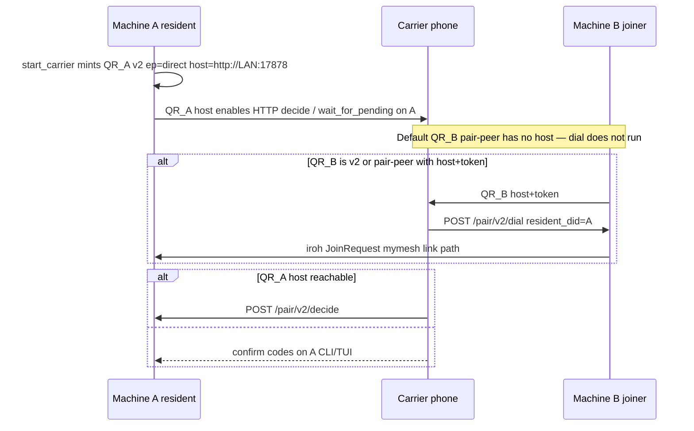
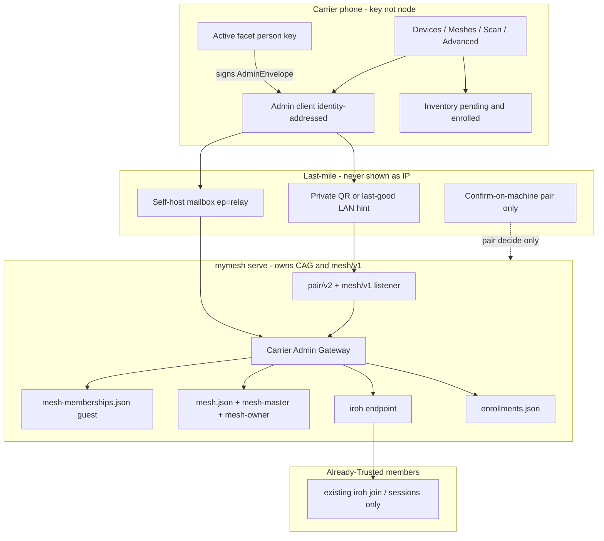
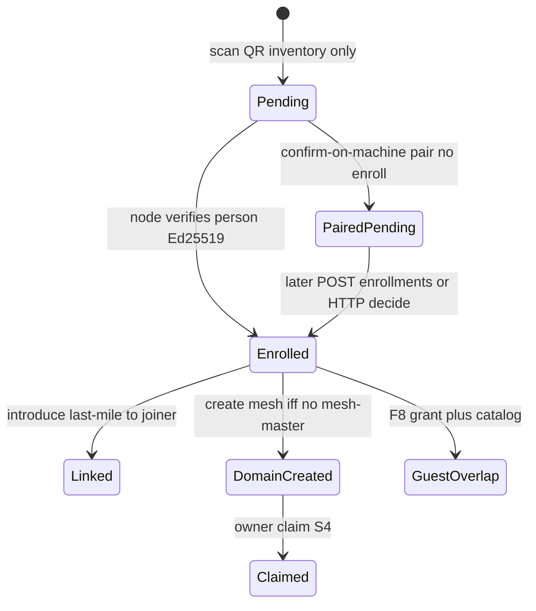
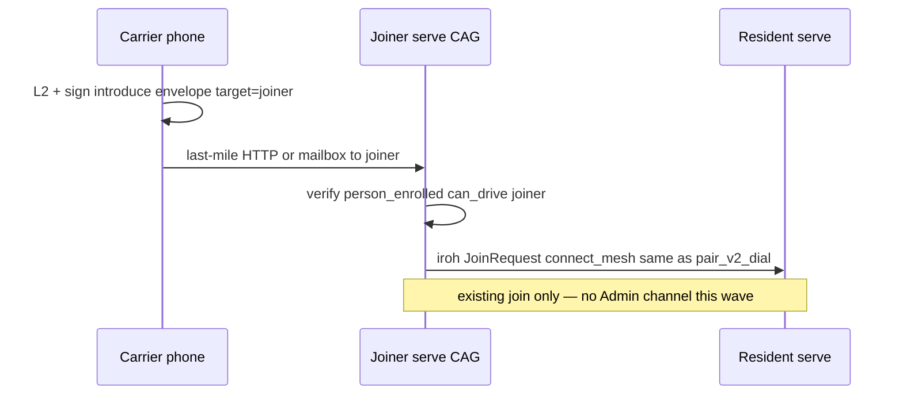

> MyMesh repo copy (`docs/CARRIER-ADMIN-NEXT.md`). Twin: Carrier `docs/design/CARRIER-ADMIN-NEXT.md`.

# Carrier as Mesh Administrator — Wave F (Domains, Enrollment, Identity-Addressed Gateway)

| Field | Value |
|-------|--------|
| **Title** | Carrier Admin Next: key + enrolled inventory + mesh domains |
| **Author** | design skill |
| **Date** | 2026-08-13 |
| **Status** | Draft (rev 4 — SessionDecision enroll fields + introduce last-mile only) |
| **Repos** | `/home/jim/Workspace/carrier` @ `feature/car-mesh-improv` (`de7ab3d`), `/home/jim/Workspace/MyMesh` @ `feature/car-mesh-improv` (`d78da72`) |
| **Scope** | Next improvement wave **after** S0–S9 / Waves A–E (already landed). Dual-repo, tip-based on the existing integration branch. |
| **Durable copies (land in F0)** | Carrier `docs/design/CARRIER-ADMIN-NEXT.md`; MyMesh twin `docs/CARRIER-ADMIN-NEXT.md`. **Do not overwrite** `docs/design/MYMESH-CARRIER-NEXT.md` / `docs/CARRIER-NEXT.md`. |
| **Normative priors** | Carrier: `docs/OWNERSHIP.md`, `docs/GUEST.md`, `docs/FACETS.md`, `docs/protocol/PAIR-V2.md`, `docs/protocol/MESH-API.md`, `docs/TRUST-MODEL.md`. MyMesh: `docs/MASTER-KEY.md`, `docs/PAIR-V2.md`, `docs/JOIN.md`, `docs/GRANTS.md`, `docs/GUEST.md`. |
| **Integration branch** | `feature/car-mesh-improv` in **both** repos. Tip-based PRs. Graphite is **not** required and is not in use. |

---

## Overview

Waves A–E shipped a working dual-authority mesh: MMK, owner claim, guest grants, real topology, pair/v2 dual-scan + confirm-on-machine, facets, continuity. The last tip (`de7ab3d` / `d78da72`) added a **LAN remote-control convenience**: TUI QR_A embeds `host=http://<lan-ip>:17878`, and Carrier Accept can POST `/pair/v2/dial` **on the joiner** when QR_B carries `host=`+token, so machine B runs the same path as `mymesh link <A>`. That path is real — and **IP-shaped**. It is not the product.

**Carrier is a key, not a MyMesh node.** It does not run an iroh agent, files, terminal, or mesh gossip. It signs. Nodes execute. After a node is **enrolled** (person sig verified on that node), Carrier is an **extended administrator of that machine** within a **narrow** op set — not a remote filesystem root. Scan is the start of enrollment, not “open TCP to this LAN IP.” Pairing two machines is the first ceremony, not the whole product.

This wave (Wave F) re-orients the default UX to **identity + enrolled inventory + mesh domains**, keeps host/IP/emulator fields on a **release-visible Advanced** screen, and defines an **identity-addressed Carrier Admin Channel**: phone → last-mile → **CAG inside `mymesh serve`** on the **target** enrolled node. Wave F does **not** open a new iroh admin channel. The phone never becomes a long-lived iroh peer. Cellular/NAT honesty is explicit: remote admin from a network that cannot reach the **target** node requires a **self-host mailbox** (already reserved `ep=relay`, operator-run only) or confirm-on-machine.

**This-wave honesty (rev 4):** create-mesh is first `mesh init` only; confirm-on-machine completes **pair**, not enroll; dual-scan enrolls the **resident** only after a verified `carrier-enroll-v1` sig on an **extended** `SessionDecision` (`facet` + `person_public_key_hex`); introduce last-mile is always the **joiner** and uses existing `connect_mesh` / `JoinRequest` (never an iroh admin forward); overlap in F8 is **catalog + guest**; **no** `Hello.admin_plane`, **no** `OpenChannel(Admin)`, **no** `AdminForwardFrame` this wave.

---

## Background & Motivation

### What Waves A–E actually shipped (do not rebuild)

| Area | Carrier (`de7ab3d`) | MyMesh (`d78da72`) |
|------|---------------------|--------------------|
| Pair | `pair_client.rs` v1+v2; dual-scan; confirm codes; **LAN `/pair/v2/dial`** when **QR_B** carries `host=`+token | `PairSessionStore`; `/pair/v2/{status,pending,decide,dial}`; TUI QR_A with LAN host (`tui_app.rs` `ensure_pair_qr_a` → `start_carrier`) |
| Auth | Person Ed25519 per facet; `person_owner` after claim | MMK/MRK; `mesh-owner.json`; mesh/v1 challenge-response (`Authorization: Bearer`, not `Mesh`) |
| Grants | `GrantService` + Share UX (host field) | `grants.json`; guest skips `MembershipSnapshot` |
| Topology | `TopologyService` keyed by **host URL** | `GET /mesh/v1/topology`; one `mesh.json` / one `mesh_id` |
| Facets | personal/work keys + mesh allowlist union on Accept | Grant `identity_facet` fail-closed |
| Continuity | pack seal / materialize / wipe (host field) | `/mesh/v1/continuity/*` |
| Process | Phone HTTP to `:17878` | **`mymesh carrier`** binds `:17878` and serves `/pair/v2` + `/mesh/v1`; **`mymesh serve`** is the only iroh endpoint and does **not** start carrier |

Independence still holds: MyMesh CLI + MMK works with no phone. Carrier is preferred admin UX, not a required control plane.

### Pain that motivated this wave

1. **Product misread as “phone talks to LAN IPs.”** Default debug hosts are `http://10.0.2.2:17878` on Owner / Share / Topology / Continuity (`MainActivity.kt` lines 140–178). Pair entry still has manual host+token+fp. Topology, claim, and grants are “type a URL.”
2. **Scan ≠ enroll.** Scanning QRs does not persist an inventory. There is no `EnrollmentStore` on the node and no device catalog on the phone (only Keystore facets + in-memory pair session + topology cache keyed by host).
3. **`not_bound` / “phone should tell B to link A.”** Fixed on LAN by `/pair/v2/dial` **when QR_B has host+token**. User then clarified: after enrollment, that introducer must work **without displaying `192.168…:17878`**, and without requiring both machines on the same LAN.
4. **One mesh per node.** `MeshState` (`mymesh-core/src/mesh.rs`) is a single `mesh_id`. `adopt_mesh_id` **merges** by lexicographic UUID — the opposite of overlap. Guest overlap can reuse grants; member overlap cannot be a filter on today’s flat `DeviceStore`.
5. **Admin verbs are missing.** No create-mesh, no assign, no overlap catalog. Home chrome is Pair / Identity / Ownership / Share / Topology / Continuity — ceremony surfaces, not domains.

### Current last-mile (tip) — accurate to code

Today’s LAN introducer needs **two** host-bearing QRs. Default QR_B is `mymesh://pair-peer?v=1&did&fp&label` (`tui_app.rs` `pair_peer_uri`) — **no** `host`/`token`. `joiner_can_dial()` is true only when QR_B is a v2 pair QR (or pair-peer) that carries both (`pair_client.rs` `joiner_dial_creds_from_qr`).



**Normative reading:** QR_A `host=` → last-mile / HTTP **decide** on the resident. QR_B `host=` → **dial** on the joiner. Pair-peer without host never dials. Demoting `/pair/v2/dial` keeps the endpoint; F9 must not “remove” QR_A `host=` if that field is the LAN last-mile bootstrap (KD-F18).

This remains a **valid Advanced / lab** path for explicit LAN helper (HTTP decide + dial). It must not be the *displayed* product path.

---

## Goals & Non-Goals

### Goals

| ID | Goal |
|----|------|
| G1 | **Carrier is a key.** Default UX: who is signing (facet) + enrolled devices + mesh domains. No iroh/files/terminal on the phone. |
| G2 | **Enrollment ≠ owner ≠ create-mesh ≠ assign.** Each ceremony named, louder as authority grows. Scan ≠ mesh owner. Confirm-on-machine ≠ enroll. |
| G3 | **Identity-addressed contact.** After a **verified** enroll, phone addresses nodes by device id / 24 words. IPs never **shown** in default chrome (QR may still carry a private `host=` hint). |
| G4 | **Enrolled node is the last-mile terminus.** Phone → last-mile → CAG **in `mymesh serve`** on **that** node. Signed by the person key. No new iroh admin plane this wave. |
| G5 | **This wave:** create first mesh (init only), guest overlap + membership catalog. **Not this wave:** member-overlap gossip (F8b), leave+join move (F8c). |
| G6 | Keep Wave A dual-scan + confirm as the **first pair ceremony**. Dual-scan **enrolls the resident** when person sig is verified; joiner enroll is a separate write. LAN `/pair/v2/dial` stays; display/preference become Advanced. |
| G7 | Airgapped mesh with an owner remains possible (confirm-on-machine + host-local CLI + optional Advanced host). |
| G8 | MyMesh-without-Carrier remains first-class. MMK still wins destroy/re-init. Host-local CLI can still refuse/recover a box if the phone is lost. |
| G9 | Dual-repo contracts + goldens **before** feature code. Fail closed. Least placeholders. |
| G10 | Tip-based PRs on `feature/car-mesh-improv` in both repos; lockstep where wire changes. Independently reviewable slices. |

### Non-goals

| Non-goal | Rationale |
|----------|-----------|
| Phone as long-lived iroh mesh peer | Existing KD16; do not “solve contact” by making Carrier a node |
| Public multi-tenant Carrier/MyMesh relay | `ep=relay` remains **self-host only** (KD31) |
| Overwriting Waves A–E contracts | PAIR-V2, MESH-API, OWNERSHIP, GUEST stay; this wave **extends** |
| Full federation / service-hotel | Grant object stays Device; no new grant kind in F1 |
| Dual-MMK / second `mesh-master.json` on one box | Out of scope; create-mesh refuses if already inited |
| Member-overlap gossip / `DeviceRecord.memberships` in F8 | F8b; types specified there, not frozen as implemented in F1 |
| `mode=move` leave+join in F8 | Multi-node protocol; F8c after F8b |
| iOS shell | Android + UniFFI boundary only |
| GlassSpear attach production | Still parked |
| Replacing CLI link / confirm / MMK | MyMesh-only path must not regress |
| Silent god-mode from a scanned phone | `person_enrolled` is **not** host-local CLI over the network |

---

## System Model

### Nouns (additive to S0)

| Noun | Definition | Persistence |
|------|------------|-------------|
| **Person / facet** | Who is signing. `personal` \| `work`. Unchanged. | Phone Keystore |
| **Device** | MyMesh node. `DeviceId` = Ed25519 pubkey; words = BIP39 display. | `identity.key` |
| **Pending inventory** | Phone saw this device (scan). **Not** `can_drive`. | Phone `inventory.json` `state=pending` |
| **Enrollment** | Node has verified a person Ed25519 and wrote `enrollments.json`. Phone may then mark `state=enrolled`. | Node: `enrollments.json`. Phone: `state=enrolled` |
| **Inventory** | Phone catalog of pending/enrolled devices + known meshes + preferred gateway. **Not** a mesh roster. | `{filesDir}/inventory.json` |
| **Mesh (domain)** | Policy domain: one `mesh_id`, one MMK, one optional owner claim, one member roster. | `mesh.json` (primary) + `mesh-master.json` + `mesh-owner.json` |
| **Primary membership** | The mesh this node gossips as “home.” Today’s `mesh.json`. | `mesh.json` |
| **Guest overlap** | Additional domain this node sits in as **guest** (existing Grant). This wave. | `mesh-memberships.json` + `grants.json` |
| **Member overlap** | Additional domain as **member**. **F8b only.** | `DeviceRecord.memberships` + catalog |
| **Owner claim** | Person owns **this mesh_id**. Unchanged S4. Distinct from enrollment. | `mesh-owner.json` (primary mesh only) |
| **Gateway (CAG)** | Last-mile HTTP/mailbox executor **inside `mymesh serve`**. Forwards over iroh only if Trusted. | Serve process + enrollments |
| **Last-mile** | How the phone reaches **that** node without being a peer: private QR/LAN hint, self-host mailbox, or confirm. | Private hints; never default UI |
| **AdminEnvelope** | Person-signed RPC. | Ephemeral; audit hashes; optional seal to device pk |

### Authorities (unchanged dual authority + narrow enrollment)

```text
                    ┌──────────────────────────────────────────┐
                    │     Mesh / node administrative ops        │
                    │  create first domain, guest overlap,      │
                    │  claim, rotate MMK, introduce joiner      │
                    └───────────────────┬──────────────────────┘
                                        │
        ┌───────────────────────────────┼───────────────────────────────┐
        ▼                               ▼                               ▼
┌───────────────┐            ┌──────────────────┐            ┌────────────────────┐
│ MMK / MRK     │            │ Host-local CLI   │            │ Carrier person     │
│ POLICY ROOT   │            │ filesystem root  │            │ enroll = narrow    │
│ destroy/reinit│            │ on that box      │            │ drive; claim =     │
│               │            │ always wins box  │            │ mesh admin         │
└───────────────┘            └──────────────────┘            └────────────────────┘
```

**Invariants (normative):**

1. **MMK wins** mesh-destructive ops (clear owner, re-init policy, emergency kick-all). Phone never holds MMK/MRK.
2. **Owner claim** is portable day-to-day **mesh** admin, subordinate to MMK. Scan does not create it.
3. **Enrollment** is a **narrow remote drive** of *this box*. It is **not** host-local CLI over the network and **not** `Capability::Admin`. Allowed ops are listed in the authz matrix. Create-mesh still needs an absent `mesh-master.json` plus MMK ceremony on the box.
4. **Host-local CLI** can always refuse, revoke enrollment, or recover that machine if the phone is lost.
5. **Remote Admin cap** on a Trusted **member device** is still not the phone (phone is never `device_member`).
6. Compromising a guest device never yields MMK, person seed, or other meshes’ rosters.
7. **Confirm-on-machine completes pair, not enroll.** Node `enrollments.json` is written only when that node verifies a person Ed25519.
8. **One MMK file per box.** Create-mesh is `mesh init` iff `mesh-master.json` is absent; otherwise `conflict mesh_already_inited`.

### Ceremonies (this wave)

| Ceremony | Phone? | What it establishes | Loudness |
|----------|--------|---------------------|----------|
| **Scan** | Yes | Phone **pending** inventory row (id, words, fp, private last-mile hint if QR had `host=`). | Quiet, L1/L2 to persist |
| **Enroll (verified)** | Yes + last-mile or HTTP decide | Node `enrollments.json` + phone `state=enrolled`. Person may **narrow-drive** this node. | Quiet, L2 |
| **Dual-scan pair** | Yes | A↔B Trusted members. **Resident enroll** if person sig verified on A. Joiner stays pending until its own enroll write. | Medium |
| **Introduce / link** | Yes | Tell **enrolled** joiner B to iroh-dial A. Last-mile **to B**. | Medium |
| **Confirm-on-machine** | Optional | Wave A zero-HTTP **pair** decide. Does **not** write `enrollments.json`. | Medium |
| **Create mesh** | Preferred | `mesh init` on a box with **no** `mesh-master.json`. | **Loud** |
| **Owner claim** | Preferred | Person owns that `mesh_id` (existing S4). | **Loud** |
| **Guest overlap** | Preferred | Device keeps primary; adds dest **guest** grant + catalog row. | Medium |
| **Revoke enrollment** | Either | Node refuses that person; phone drops or marks revoked. | Medium |
| **CLI link / MMK / kick** | No | Unchanged MyMesh-only path. | — |
| **Assign / move / member overlap** | — | **Not this wave** (F8b / F8c). | — |

**Wording fix:** “Open topology against `http://10.0.2.2:17878`” is not a ceremony. It is Advanced last-mile.

### Facets vs overlap (do not conflate)

| | Facet | Overlap |
|--|-------|---------|
| Question | **Who** is signing? | **Where** does the machine sit? |
| Example | personal vs work keys on the phone | Kitchen-PC is **member** of Home and **guest** of Studio |
| Store | Phone `IdentityFacet` + allowlists | This wave: catalog + grants. F8b: `DeviceRecord.memberships` |
| Both | A work facet can enroll a laptop that is a guest of Home | Yes — orthogonal |

---

## Proposed Design

### High-level architecture (Wave F)



**Process (KD-F16, frozen in F1):** `mymesh serve` **owns** the iroh endpoint **and** the pair/mesh HTTP listener (`:17878`), `MeshAuthStore`, CAG, mailbox poller, and file-backed rate limits / admin nonces. `mymesh carrier` is a **lab-only** thin alias: if serve is up, it refuses to bind and prints “serve owns pair HTTP”; if serve is down, it may bind for emulator/airgap (warning on stderr). TUI `start_carrier_ui` arms QR_A via **`MMA1`** (below) — **not** by stuffing a command into the `MMD1` dial-proxy handshake.

**Local admin socket (`MMA1` — F4p, do not overload `MMD1`):**

`mymesh-net/src/local_dial.rs` is a **dial-only** proxy: client writes `MMD1` + 32-byte device id; the agent `transport.connect`s; the stream becomes a raw frame bridge. There is no command opcode. Putting `arm_pair_qr` on that 36-byte handshake **breaks** `mymesh link` / `connect_mesh` (including `pair_v2_dial` and F5 introduce).

F4p accept loop **must read 4 magic bytes first**, then branch:

```text
# same path as daemon.control_socket (default $XDG_RUNTIME_DIR/mymesh.sock)

MMD1 || device_id_32     → existing dial proxy (unchanged after the 4-byte split)
MMA1 || u32le(len) || json  → local admin; never a frame bridge

MMA1 request JSON:
  { "cmd": "arm_pair_qr", "ttl_secs": 600 }

MMA1 response JSON:
  { "ok": true, "qr": "carrier://pair?v=2&…", "sid": "…", "host_base": "http://…" }
  { "ok": false, "code": "…", "error": "…" }

Unknown cmd → { ok: false, code: "bad_request" }
Unknown 4-byte magic → close (do not attempt MMD1 did-read)
```

`host_base` in the MMA1 response is for the QR payload / HintBlob only — TUI must not display it. Mode 0600 on the socket stays. No second socket required (one `control_socket` config). A second socket is allowed later but **not** this wave’s default.

F4p tests (required): (1) `connect_mesh` / MMD1 still works after an MMA1 `arm_pair_qr`; (2) `mymesh serve` + `curl /pair/v2/status` **without** `mymesh carrier`.

### Product surface (Android)

**Today (`HomeScreen.kt`):** Pair, Identity, Ownership, Share, Topology, Continuity, Lab attach (debug), Activity.

**Wave F chrome (additive in F3; existing screens stay until F9+):**

| Surface | Job |
|---------|-----|
| **Devices** | Inventory. Pending vs enrolled badge. Words, fp, memberships **known locally**, gateway badge, reachability **class** (`nearby` / `via mailbox` / `needs last-mile` / `offline`). Tap enrolled → guest-overlap / revoke enroll. **No host field.** |
| **Meshes** | Names this facet **created or claimed** (inventory). Roster **only** after `person_owner` (or existing pair_read minimal). Create / claim. **Not** “full household from enroll.” |
| **Scan** | Camera-first dual-scan or single-node. Writes **pending**. Enroll completes when last-mile/HTTP decide verifies person sig. |
| **Identity** | Facet switch + allowlists (unchanged). |
| **Advanced** | **Release-visible** settings (not debug-only): mailbox URL, LAN helper, manual host/token/fp, emulator `10.0.2.2:17878` / attach `7843`, “use HTTP decide on Accept.” |
| **Activity** | Audit (unchanged). |

F3 **does not** remove host fields from Owner / Share / Topology / Continuity. F9 may collapse them behind Advanced **after** last-mile works.

**Copy rules:**

- Never **render** `192.168.`, `10.0.2.2`, or `:17878` outside Advanced. QR payload **may** still contain `host=` (KD-F18).
- Address devices as **words** (primary) + short id. Hex behind a tap.
- Reachability: “Kitchen-PC is nearby” / “waiting on mailbox” / “scan again or confirm pair on the machine” / “offline” — never “connection refused to http://…”.
- Pending: “Seen — enroll when reachable.” Do not offer introduce / create-mesh / overlap on pending.

### Enrollment vs owner vs create vs guest overlap



#### 1. Enrollment (scan → pending → verified)

**Meaning:** “I may narrow-drive this machine while using Carrier.” Not mesh owner. Not Admin. Not full CLI.

**Phone `InventoryDevice`:**

```text
device_id_hex, words, fingerprint, label,
facet_kind,
state: pending | enrolled | revoked,
enrolled_at: Option,          // set only after node ack
memberships_local: [{ mesh_id, role, primary }],  // from GET /memberships after enroll
preferred_gateway: bool,
reachability: { class, mailbox_id?, last_hint: HintBlob? }
```

No `enroll_token_hash`. Standing auth is mesh challenge-response (`person_enrolled`).

**`HintBlob` (F1 golden) — private last-mile wrap:**

```text
key = HKDF-SHA256(
        ikm = facet_seed_32,                    // unwrapped in Keystore path, L2
        salt = empty,
        info = "carrier-admin-hint-v1"
      )
aad = "carrier-admin-hint-v1" || device_id_32
nonce = 24B random
ciphertext = XChaCha20-Poly1305(key, nonce, aad, plaintext_url_utf8)

HintBlob JSON: { v: 1, nonce_b64, ct_b64 }
```

Never logged, never rendered. Seeded from QR `host=` (KD-F18) and refreshed on successful last-mile. Cleared on revoke.

**Node `enrollments.json` (0600, `Paths::enrollments_file`):**

```json
{
  "version": 1,
  "enrollments": [
    {
      "enrollment_id": "01HZX…",
      "person_id": "…",
      "person_public_key_hex": "…64 hex…",
      "facet": "personal",
      "enrolled_at": "2026-08-13T12:00:00Z",
      "can_drive": true,
      "label": "optional phone name"
    }
  ]
}
```

**`carrier-enroll-v1` preimage (F1 golden — one domain for every enroll write):**

```text
carrier-enroll-v1
  || u16le(len) || person_id_utf8
  || u8 facet                 // 0x01 = personal, 0x02 = work
  || target_did_32            // node being enrolled (raw DeviceId)
  || i64le(ts_unix)
  || nonce_16                 // raw 16 bytes
  || person_pk_32             // raw Ed25519 public key

sig = Ed25519(person_seed, preimage)
```

| Path | `target_did` | `ts` | `nonce` | `sig` location |
|------|--------------|------|---------|----------------|
| `POST /pair/v2/decide` enroll | resident `did` | `SessionDecision.ts` | **pair session nonce** (same 16B as QR_A) | `SessionDecision.sig_hex` over **`carrier-enroll-v1`** (not SessionDecision canonical bytes) |
| `POST /mesh/v1/enrollments` | body `target_device_id_hex` (must be **this** node) | body `ts` | body `nonce` (fresh 16B) | body `sig_hex` |
| `AdminEnvelope` `op=enroll_ack` | `target_device_id_hex` | **payload** `ts` (same as POST) | **payload** `nonce` | envelope `sig_hex` = `carrier-admin-v1`; payload `enroll_sig_hex` = `carrier-enroll-v1` |
| `mymesh enroll add` | this node | `--ts` | `--nonce` | `--sig-file` = 64-hex or raw 64B |

**`SessionDecision` additive JSON (F1 — HTTP JSON, `serde(default)`, Wave A compatible):**

Landed fields stay: `sid, decision, joiner_device_id_hex, resident_device_id_hex, ts, nonce, person_id?, sig_hex?`.

```text
# additive, omit or null = pair-only
facet: Option<"personal" | "work">          // serde default None
person_public_key_hex: Option<String>       // 64 hex; serde default None
```

Verify enroll **only if** `person_id`, `facet`, `person_public_key_hex`, and `sig_hex` are **all** present. Then build `carrier-enroll-v1` with:
- `person_id` / `facet` (`personal`→`0x01`, `work`→`0x02`) / `person_pk_32` from hex
- `target_did_32` = resident
- `ts_unix` = `SessionDecision.ts` parsed RFC3339 → `i64` UTC (same as mesh/v1)
- `nonce_16` = pair session raw nonce (must match body `nonce`)

Any of those four absent → **pair-only** (Wave A); do not enroll. Present but bad sig / unknown facet / pk ≠ signer / `target_did` ≠ resident → enroll write **skipped**, pair decide may still succeed. PAIR-V2’s optional audit signature over SessionDecision canonical bytes is **not** used for enroll.

**`POST /mesh/v1/enrollments` body (F1) — also the `enroll_ack` payload shape:**

```json
{
  "person_id": "…",
  "facet": "personal",
  "target_device_id_hex": "…64 hex…",
  "ts": "2026-08-13T12:00:00Z",
  "nonce": "<base64url 16B>",
  "person_public_key_hex": "…64 hex…",
  "sig_hex": "…128 hex…",
  "label": "optional"
}
```

`enroll_ack` `payload_json` is **exactly that object** with `sig_hex` renamed **`enroll_sig_hex`** (so it is not confused with the envelope’s `carrier-admin-v1` `sig_hex`). Same preimage; `ts` skew ±5 min; `nonce` replay via `admin-nonces.json`; `target_device_id_hex` must equal the serving node.

F1 goldens: `carrier-enroll-v1` bytes **and** an extended decide body (`testdata/wire/session-decision-enroll.json`) with `facet` + `person_public_key_hex` + `sig_hex`. Wave A decide fixture without those fields must still round-trip.

**When the node writes a row (only these):**

| Path | Writes `enrollments.json`? |
|------|----------------------------|
| `POST /pair/v2/decide` with valid `carrier-enroll-v1` `sig_hex` | **Yes** (resident) |
| `POST /mesh/v1/enrollments` with valid `carrier-enroll-v1` | **Yes** (that node) |
| `AdminEnvelope` `op=enroll_ack` with valid nested `carrier-enroll-v1` | **Yes** |
| Confirm-on-machine (`apply_pair_confirm`) | **No** |
| Dual-scan bind on the phone only | **No** (phone pending only) |
| Host-local `mymesh enroll add --person-id --facet --ts --nonce --person-pubkey --sig-file` | **Yes** (airgap) |

**Fail closed:**

- Phone must not treat `state=pending` as `can_drive`. UniFFI introduce/create/overlap on pending → `EnrollmentPending`.
- Unknown / bad person sig → no enrollment write; pair decide may still succeed as Wave A pair-only.
- Facet allowlist deny → no enroll (`FacetNotAllowed`).
- `mymesh enroll revoke <person_id>` always works (filesystem root).
- Enrollment does **not** insert the phone into `devices.json` and does **not** grant `Capability::Admin`.

**Dual-scan honesty (KD-F19):**

- **Resident (A):** enrolled iff A verified a **`carrier-enroll-v1`** sig (HTTP decide or later `POST /enrollments` / `enroll_ack` via last-mile to A). Confirm-only pair → A stays **not** enrolled; phone keeps A **pending** (hint cached if QR_A had `host=`).
- **Joiner (B):** never sees `SessionDecision`. Dual-scan does **not** enroll B. After A↔B are Trusted, the phone **may** `POST /enrollments` to B **if and only if** last-mile to B exists (QR_B `host=`, mailbox on B, or Advanced). Else UX: “B is linked, not enrolled — scan B again when reachable.”
- Do **not** claim both machines are enrolled until **both** `enrollments.json` rows exist.

#### 2. Owner claim (unchanged S4, re-homed in UX)

Still MMK-gated on the agent (co-sign / claim-window / CLI). Phone sends person sig only. UX: action on a **Mesh** (“Claim Home”), not a host form. Last-mile is **that** node (or Advanced host). `owner_claim_fwd` in an envelope is **transport only**; execution still requires the MMK window/unlock on the claiming node.

#### 3. Create mesh (loud, first init only — KD-F11 / OQ-d **B**)

```text
POST /mesh/v1/meshes
Authorization: Bearer <person_enrolled session>
{ "display_name": "Home", "claim_after": false }

1. Target is the enrolled node the phone last-miled (identity address).
2. If mesh-master.json exists → 409 conflict mesh_already_inited.
   Copy: “Kitchen-PC already has a mesh master. Pick a box that has not
   been inited, or use CLI on that machine.”
3. If mesh-master.json absent:
   a) MRK/password ceremony on the node: `mymesh mesh allow-create
      --secs 300` or TUI modal. Unlock alone is not enough.
   b) Node runs mesh init: wrap new MRK, set mesh.json display_name,
      write mesh-memberships.json single primary row.
   c) Recovery codes → TUI modal if TUI attached, else one-shot
      `mesh-recovery-once.txt` mode 0600 under data_dir. Never logs,
      never HTTP, never phone. `mymesh mesh recovery-show-once` prints
      and deletes the file.
4. Phone never receives MMK. Optional immediate S4 claim if window/MRK live.
5. Inventory adds Mesh { mesh_id, name, created_on, claimed: bool }.
```

**Not create:** scanning two machines; they join the **resident’s existing** primary (or remain a fresh uninited UUID until someone inits). **No** “create Studio on a Home box.” **No** `set_primary` as a create option. **No** two-node “init on designated home node.”

#### 4. Assign / move — **out of F8**

Leave+join is a two-phase multi-node protocol. **Not shipped in Wave F8.** Specified so F8c can implement later without inventing authz:

```text
Phase 1 — authorize (on a dest member that holds dest MMK or dest owner session):
  POST /mesh/v1/memberships/authorize
  { device_id_hex, to_mesh_id, role, not_after }
  → { authz_token, dest_served_by }

Phase 2 — apply (on the subject device, person_enrolled + authz_token):
  POST /mesh/v1/memberships/apply
  { authz_token, mode: "set_primary" }   // mode=move is F8c

Failure: conflict membership_partial. Leave must not run until dest apply
will succeed. mode=move (leave source + join dest) is F8c and requires
F8b DeviceRecord.memberships. set_primary is only legal if dest is already
a membership row AND dest’s MMK lives on that box (i.e. dest == primary
after a previous init — not a second domain).
```

F8 ships **neither** `assign` nor `move`. UI must not show “Move to Studio.”

#### 5. Overlap this wave = guest only (OQ-a **C**)

```text
POST /mesh/v1/memberships
{
  "device_id_hex": "…",
  "mesh_id": "…",          // dest, must exist on dest policy node
  "role": "guest",         // "member" → 501 not_implemented until F8b
  "grant": { object_device_id_hex, capabilities, not_after_days }
}
```

- Device **keeps** primary `mesh.json` / MMK / owner files.
- Writes catalog row `role=guest` + existing `Grant` (`GrantObject::Device`, `mesh_id` already on Grant).
- No full dest roster (KD19). No `adopt_mesh_id`.
- Authz: dest `person_owner` | dest `mrk_proof` | dest `device_member`+Admin for the **grant**; subject `person_enrolled` only to **accept** the guest row on the subject (or host-local). Two-step if dest and subject differ: create grant on dest object host, then subject catalog update when last-mile hits the subject.

**F8b (specified, not this-wave implementation) — `DeviceRecord.memberships`:**

```rust
// Additive on DeviceRecord; missing field → [primary mesh_id as member]
pub struct PeerMembership {
    pub mesh_id: String,
    pub role: MeshRole, // Member | Guest
}

// DeviceRecord.memberships: Vec<PeerMembership>
// DeviceRecord.mesh_id remains primary hint (first Member or mesh.json id)

// members_from_store(store, self_id, mesh_id) -> only Trusted
//   whose memberships contain (mesh_id, Member)
// apply_membership(..., mesh_id, ...):
//   NEVER adopt_mesh_id unless mesh_id == local primary
//   upsert peer memberships for that mesh_id only
//   do not rewrite other meshes' memberships
// KickAnnounce / leave: scoped by mesh_id
```

F1 **does not** golden `PeerMembership` as a live wire. F8b lands types + goldens + gossip. Extra `role=member` before F8b is `not_implemented`.

---

### Identity-addressed reachability (the last mile)

#### Honesty table (normative — do not overclaim)

| Phone network | Node network | Phone-iroh? | Works without extra infra? | Wave F path |
|---------------|--------------|-------------|----------------------------|-------------|
| Same LAN | Same LAN | No | **Yes** if QR carried `host=` (private hint) | Hidden LAN last-mile |
| Same LAN | Same LAN, never saw `host=` | No | **No** automatic HTTP | Confirm pair / Advanced / rescan with helper |
| Cellular | Home NAT, no mailbox | No | **No** | Confirm-on-machine **or** Advanced host |
| Cellular | **That node** registered to mailbox | No | **Yes** (both dial out) | Mailbox last-mile **to that node** |
| Airgap | Airgap | No | Confirm / sneakernet | Confirm pair + CLI enroll add |
| Cellular | Other mesh member reachable via iroh | No | Node↔node **yes** if already Trusted; phone→unlinked node **no** | Introduce cannot bounce via A to unlinked B |

#### Last-mile order (closes OQ-b / OQ-f)

```text
To reach device D (never “any gateway” unless D is that node):
1. If standing Bearer session to D is live → use it.
2. Else try D’s HintBlob (2s, never render URL).
3. Else if D has mailbox_id → mailbox last-mile to D.
4. Else → pending/offline copy; pair confirm if a pair session is open;
   or Advanced host.
```

**First enrolled (`state=enrolled`) gateway-capable node is preferred gateway** (OQ-c). Gateway-capable = serve up **and** (hint or mailbox succeeded once). User can change. Fail over: any other **enrolled** node with a live last-mile. Preferred gateway is used for ops **targeted at that node**. Wave F does **not** forward AdminEnvelopes over iroh.

#### Carrier Admin Gateway (in serve)

CAG is a module in `mymesh-session`, **run by `mymesh serve`** (KD-F16). It serves `/mesh/v1/*` and `/pair/v2/*` on `:17878` in-process (same `Paths`, same `MeshAuthStore`).

**Inbound:**

| Adapter | When | Implementation |
|---------|------|----------------|
| **Local HTTP** | Private hint / Advanced host | Serve-owned `:17878` |
| **Mailbox** | Cellular | Serve **polls outbound** `GET /v1/admin/{did}/inbox` |
| **Confirm** | Pair only | Existing `pair confirm` — **not** a general admin ack in this wave |

**Outbound iroh this wave:** **none for admin.** Introduce uses existing `connect_mesh` + `JoinRequest` (same as `pair_v2_dial`). Control frames are **bincode** (`frame.rs` `encode_msg` / `decode_msg`). `ControlMessage::Hello` is a closed positional struct. `#[serde(default)]` does **not** make a new trailing field mixed-mesh safe — a new peer decoding an old Hello will read past `signature` and fail. Therefore:

- **Do not** add `Hello.admin_plane` (or any field) to `Hello` / `HelloAck` in F1 or F5.
- **Do not** send `OpenChannel(Admin)` or any new `ControlMessage` variant this wave. Old peers cannot decode a new bincode variant; `read_frame` today maps unknown **frame-kind bytes** to `io::Error` “unknown channel kind” and **tears down the read loop** (`frame.rs` 47–48).
- F1: **comment-reserve** frame-header kind byte `6` in `channel.rs` only. `ChannelKind::from_u8` stays `None` for 6. Do **not** add an enum variant. Frame header `as u8` (`Control=1` … `Tcp=5`) is **not** the same encoding as bincode variant index.
- F5 (optional, new peers only): `read_frame` may **skip** unknown kind bytes (consume length, continue) so a **later** wave can send kind 6 without killing mixed sessions. Until every peer has that skip, **never send kind 6**.
- **`AdminForwardFrame` is deferred** until there is a non-Hello advertisement (e.g. HTTP `GET /mesh/v1/gateway` after last-mile). Not an F1 golden. Not a Wave F success path.



#### AdminEnvelope (wire freeze F1)

```text
AdminEnvelope {
  v: 1,
  op: enroll_ack | create_mesh | overlap_guest | introduce |
      owner_claim_fwd | memberships_self | enroll_revoke_self,
  target_device_id_hex,     // identity address — last-mile dest
  mesh_id: Option<String>,
  ts: RFC3339,
  nonce: 16B base64url,
  person_id,
  facet: personal | work,
  payload_json,             // plaintext inside envelope; sealed in transit (F6)
  sig_hex
}

canonical preimage:
  carrier-admin-v1 || u16le(len) || op_utf8
    || target_did_32
    || u16le(len) || mesh_id_utf8_or_empty
    || i64le(ts_unix)
    || nonce_16
    || person_pk_32
    || sha256(payload_json_bytes)
```

**Removed from envelope ops:** `topology`, `grant_create`, `grant_revoke`, `assign`. Those stay on existing `/mesh/v1` routes with existing authz. `owner_claim_fwd` **forwards** a standard S4 claim body to the target node; it does not satisfy MMK.

Replay: persist nonces under `Paths::admin_nonces_file()` (`admin-nonces.json` 0600) for 15 minutes **across serve restart**. `ts` skew ±5 min. Rate limit: `LimitKind::AdminEnvelope` 30/min/person_id, file-backed in `paths.metrics_dir` (serve is the only consumer).

#### Self-host mailbox (F6)

Reuse reserved **`ep=relay`** / extend `mymesh mailbox`. **Not** a public product.

```text
# Node serve (standing poll)
GET  /v1/admin/{device_id}/inbox     # long-poll 25s
POST /v1/admin/{device_id}/outbox

# Phone
POST /v1/admin/{device_id}/inbox     # sealed blob
GET  /v1/admin/{device_id}/outbox
```

**Mailbox accept rule (F1, mailbox cannot see enrollments.json):**

- Device bind: `MailboxBind { did, ts, sig_hex }` over `carrier-mailbox-bind-v1 || did_32 || i64le(ts)`. Mailbox stores bound dids.
- Phone POST: **opaque bytes** ≤ 64 KiB to a **bound** did. No person/enrollment verify on the mailbox (it has no keys/store). Rate limit `LimitKind::MailboxBind` 10/min/ip and `MailboxPut` 30/min/did.
- Unbound did → 404. Spam/DoS: rate limit + TTL 15 min, no disk log of bodies.
- **Node** decrypts and verifies person sig + enrollment.

**Seal (F1 golden, required in F6 — not optional):**

```text
Same wrap family as continuity pack (X25519 from device Ed25519 + XChaCha20-Poly1305).
seal_preimage = carrier-admin-seal-v1 || nonce_16 || sha256(envelope_canonical_bytes)
payload on the wire = { wrap, nonce, ciphertext }   // ciphertext = AdminEnvelope JSON
```

**UX:** Advanced (release) → “Remote admin mailbox” → `https://mailbox.example`. Inventory stores `mailbox_id = sha256(url)[0..16] hex`, not the URL, on Devices. URL only in Advanced.

**Default:** mailbox unset. Copy: “To manage this PC from away, set a mailbox in Advanced — or confirm pair on the machine.”

#### Standing session

- Bearer token (`Authorization: Bearer`, same as today’s mesh/v1 — **do not** introduce `Mesh` or a third scheme).
- Keyed by **device_id**, not host URL.
- TTL 15 min (`SESSION_TTL_SECS`). In-memory on **serve** (long-lived). Process death drops sessions; inventory + HintBlob remain.
- Refresh: `GET /mesh/v1/auth/challenge` + `POST /mesh/v1/auth/session`.

**`person_enrolled` challenge preimage (F1 — device-scoped, not mesh-scoped):**

```text
mymesh-mesh-auth-v1 || 0x00 || challenge_id_utf8
  || 0x00 || nonce_32
  || 0x00 || device_id_32
  || 0x00 || "person_enrolled"
```

Do **not** bind this method to `mesh.json`’s primary id (would break if primary ever changed). `methods_allowed` includes `person_enrolled` when `enrollments.json` lists the person with `can_drive`.

**`X-Mesh-Id` (pre-F8b):** if absent or equal to primary `mesh.json` id → ok. Any other value → `400 bad_request`. Do not ignore and do not smash.

#### Introduce two machines (last-mile **always the joiner** — KD-F20)

```text
op = introduce
target_device_id_hex = joiner
payload = { resident_did, joiner_did, resident_fp }
```

1. Joiner must be `state=enrolled` for this person (`can_drive` on **B**). Resident may be pending if A is only the iroh target (link does not require A enrolled).
2. **Last-mile target is always B.** Do not deliver to preferred gateway A hoping A will reach B. If the phone cannot last-mile to B → **fail closed** `no_last_mile_to_joiner`, copy: “Reach {B words} (mailbox or same LAN) or confirm on B.”
3. **Wave F never iroh-forwards admin** (no `OpenChannel(Admin)`, no `AdminForwardFrame`; KD-F17). A Trusted path between A and B does **not** authorize CAG to forward `AdminEnvelope`. Last-mile miss is always `no_last_mile_to_joiner`. F5 tests **must** include: two enrolled, never linked, phone can only reach A → `no_last_mile_to_joiner`, no hang. Any later advertisement is F8b+ and **non-Hello**.
4. B runs the same path as `pair_v2_dial` / `connect_mesh` + `run_join_as_guest` (existing join, not an admin channel).
5. A accept: existing pair session / `requests accept` / confirm-on-machine. `person_enrolled` on A may **arm** A if A is enrolled; it may not silently accept a join without the usual arm/pending rules unless A is already armed.
6. `/pair/v2/dial` remains for Advanced LAN when QR_B has host+token.

---

### MyMesh data model

Today: one `MeshState`, `adopt_mesh_id` smash, `DeviceRecord.mesh_id: Option<String>`, grants already have `mesh_id`.

**This wave:**

```text
# mesh.json                 — PRIMARY (additive display_name?)
# mesh-master.json          — MMK of PRIMARY only
# mesh-owner.json           — owner of PRIMARY only
# mesh-memberships.json     — NEW 0600; primary row + guest overlap rows
# enrollments.json          — NEW 0600
# admin-nonces.json         — NEW 0600
# mesh-recovery-once.txt    — NEW 0600, one-shot, deleted after show
```

```json
{
  "version": 1,
  "primary_mesh_id": "aaaaaaaa-…",
  "memberships": [
    {
      "mesh_id": "aaaaaaaa-…",
      "role": "member",
      "primary": true,
      "joined_at": "…",
      "source": "init"
    },
    {
      "mesh_id": "bbbbbbbb-…",
      "role": "guest",
      "primary": false,
      "joined_at": "…",
      "via_grant_id": "01H…",
      "source": "overlap"
    }
  ]
}
```

**Gossip this wave:** unchanged `members_from_store` / `adopt_mesh_id` **except**: if `mesh-memberships.json` has any non-primary row, `apply_membership` **refuses** `adopt_mesh_id` for a foreign `mesh_id` (`conflict mesh_overlap`). Guest overlap does not put dest members into `DeviceStore` as Trusted members (grant path only).

**F8b** (later) implements `DeviceRecord.memberships` and scoped `members_from_store(mesh_id)` as specified above. Down-migration: drop `memberships` field; keep `mesh_id` primary; leftover extra Member rows become stale Trusted peers the operator must `kick` / `revoke` — document in F8b.

**Migration F8:** on first load, write catalog with one primary row from `mesh.json`. No DeviceRecord schema change.

---

### Pair ceremony: pair vs enroll; LAN hint stays in QR

| Path | Default? | Pair? | Enroll? |
|------|----------|-------|---------|
| Dual-scan + confirm-on-machine | **Yes** | Completes pair | **No** (phone pending) |
| Dual-scan + HTTP decide with person sig | If hint reachable | Completes pair | **Resident yes** |
| Introduce last-mile to enrolled joiner | After B enrolled | Link | Unchanged |
| `/pair/v2/dial` when QR_B has host= | Advanced LAN helper | Link | No |
| v1 LAN pair | `--pair-v1` | Unchanged | No |

**QR `host=` policy (KD-F18, closes OQ-f):**

- Default TUI / `start_carrier` / `pair dual` **may still emit** `host=` as a **private last-mile hint** (today’s LAN bootstrap).
- Carrier **must not render** it. Parse → `HintBlob`. Accept prefers: if Advanced “use LAN helper” → HTTP decide + dial; **else** try hint only for `POST /enrollments` / standing session, and show confirm codes for pair if operator did not enable helper.
- F9 does **not** strip `host=` from `start_carrier`. F9 stops **display** and stops **preferring** HTTP decide/dial unless Advanced helper is on.
- `--host` / TUI “show LAN helper QR” remains for operators who want the old chrome.

---

## API / Interface Changes

### Three frozen reads (KD-F21)

| Route | Auth | Returns |
|-------|------|---------|
| `GET /mesh/v1/enrollments` | host-local \| `person_enrolled` (own row only) \| `mrk_proof` | Drive bindings on **this** node |
| `GET /mesh/v1/memberships` | `person_enrolled` \| `person_owner` \| `mrk_proof` \| `device_member` \| host-local | **This node’s** catalog only |
| `GET /mesh/v1/topology` | **Unchanged:** `person_owner` \| `mrk_proof` \| `device_member` \| `pair_read` (minimal) | Dest **roster**. Enroll alone does **not** unlock this. |

Meshes UI: inventory names + **claimed** rosters. Strike topology from F4 success criteria.

### Other `/mesh/v1` additions

Served by **serve** (after F4p). Bearer only.

| Route | Auth | Purpose |
|-------|------|---------|
| `POST /enrollments` | person sig over **`carrier-enroll-v1`** (body above) \| host-local | Write verified enrollment |
| `DELETE /enrollments/{person_id}` | that person `person_enrolled` \| host-local \| `mrk_proof` | Revoke drive |
| `POST /memberships` | dest grant authz + subject drive; `role=member` → 501 | Guest overlap |
| `DELETE /memberships/{mesh_id}` | host-local \| `mrk_proof` \| `person_owner` of that mesh; guest leave also `person_enrolled` on subject | Leave guest row |
| `POST /meshes` | `person_enrolled` + MMK window + **no** mesh-master | First init |
| `POST /admin/rpc` | last-mile + `AdminEnvelope` | Identity-addressed ops listed above |

No `POST /memberships/assign` in this wave.

### Auth method enum

```text
AuthMethod = mrk_proof | person_owner | device_member | pair_read | person_enrolled
```

### UniFFI / policy

```rust
EnrollDevice,          // L2 — POST enrollments / enroll_ack
CreateMesh,            // L2 — still MMK on node; only if not inited
OverlapMembership,     // L2 — guest only
RevokeEnrollment,      // L2
IntroduceDevices,      // L2 — requires joiner enrolled
// ListMeshes L1 — inventory names, not topology
```

### CLI

```bash
mymesh enroll list
mymesh enroll revoke <person_id>
mymesh enroll add --person-id … --facet personal|work \
  --ts … --nonce … --person-pubkey … --sig-file …   # airgap; flags = preimage
mymesh mesh init                                 # existing; F7 Carrier create calls this
mymesh mesh allow-create --secs 300              # F7 — MMK window for POST /meshes
mymesh mesh recovery-show-once                   # prints + deletes mesh-recovery-once.txt
mymesh memberships list
mymesh memberships add --mesh <id> --role guest  # --role member errors until F8b
mymesh memberships leave --mesh <id>
mymesh gateway status
mymesh mailbox                                   # + /v1/admin/*
```

### Carrier clients

```text
AdminClient { resolve(device_id | words) -> LastMile; send(envelope) -> AdminResult }
LastMile = { device_id, class: Local | Mailbox, hint_private? }
```

Callers pass **device id**. Host strings only inside `Local` from HintBlob or Advanced.

---

## Data Model Changes

### MyMesh

| File | Change |
|------|--------|
| `enrollments.json` | **New.** Verified person drive bindings. |
| `mesh-memberships.json` | **New.** Primary + guest rows. |
| `admin-nonces.json` | **New.** Replay cache 15 min. |
| `mesh-recovery-once.txt` | **New.** One-shot codes if no TUI. |
| `mesh.json` | Additive `display_name?`. |
| `devices.json` | **No change this wave.** F8b adds `memberships`. |
| `grants.json` | Unchanged schema. Guest overlap = grant row. |
| `Paths` | `enrollments_file()`, `mesh_memberships_file()`, `admin_nonces_file()`, `mesh_recovery_once_file()`. |

### Carrier

| File | Change |
|------|--------|
| `{filesDir}/inventory.json` | **New.** Pending/enrolled devices + created/claimed meshes + mailbox ids. |
| Keystore | Unchanged; facet seed used for HintBlob HKDF at L2. |
| Topology cache | Still host-keyed until a **claim** last-mile; then key by `mesh_id` + `served_by_device_id`. |
| Advanced prefs | Mailbox URL, LAN helper, host overrides. **Release visible.** |

### Migration

1. F2: empty `enrollments.json` if missing.
2. F4p: serve binds `:17878`; document that standalone `mymesh carrier` is lab-only.
3. F8: catalog from `mesh.json` one primary row.
4. Inventory empty until first scan — no sample devices.
5. No automatic owner claim from enrollment.
6. F8b rollback: see F8b down-migration note.

### Quantified budgets

| Item | Budget |
|------|--------|
| Enrollments per node | 8 persons |
| Catalog rows per node | 8 (primary + guests) |
| Inventory devices on phone | 64 |
| AdminEnvelope size | ≤ 64 KiB |
| Mailbox TTL | 15 min |
| LAN last-mile timeout | 2 s |
| Mailbox round-trip | ≤ 45 s |
| Replay nonce persist | 15 min |

---

## Alternatives Considered

### A. Phone as a thin iroh peer (transport-only)

**Reject.** Violates KD16; becomes a mesh identity; battery/ALPN/lifecycle.

### B. Confirm-only after enroll until Advanced host

**Reject as the only path.** Confirm remains pair/airgap. Last-mile + mailbox are required for stay-in-contact.

### C. Public Carrier relay

**Reject as product.** Self-host mailbox only (KD31).

### D. Overlap = leave+join only

**Reject as the product north star**; **accept as this-wave subset.** Guest overlap expresses “Home member, Studio guest.” Member overlap and move wait for F8b/F8c.

### E. Cosmetic words on the same URL forms

**Reject.** Advanced keeps URLs; default chrome does not.

### F. Create-mesh allocates a new domain on an already-inited box

**Reject.** Single `mesh-master.json` cannot follow a new primary without bricking Home or lying about the policy root (Issue 1). OQ-d **B**.

### G. Strip `host=` from default QR (F9 original)

**Reject.** That deletes the only automatic LAN last-mile bootstrap. Keep `host=` as a private hint (KD-F18).

---

## Security & Privacy Considerations

### Threat model additions (C8–C13)

| ID | Threat | Severity | Control |
|----|--------|----------|---------|
| C8 | Enroll ≠ owner confused for destroy | High | Separate ceremonies; create only if uninited; claim MMK-gated |
| C9 | Stolen phone drives enrolled nodes | High | L2 every drive op; narrow authz matrix; enroll revoke CLI; session 15 m |
| C10 | Gateway confused deputy | High | Wave F does not iroh-forward admin; execute only on last-mile target after person sig verify |
| C11 | Mailbox operator reads ops | Med | Required seal to device pk; opaque store; no body logs |
| C12 | Overlap roster leak | High | Guest path only this wave; refuse `adopt_mesh_id` when extra rows exist; F8b scoped snapshots |
| C13 | Last-hint IP leak | Med | Never log/render URL; wrap HintBlob; Advanced only for plaintext host |

### Authz matrix (every envelope op + HTTP)

| Op | `person_enrolled` | `person_owner` (that mesh) | `mrk_proof` | host-local |
|----|-------------------|----------------------------|-------------|------------|
| Scan → pending inventory | n/a (phone local) | n/a | n/a | n/a |
| `POST /enrollments` / `enroll_ack` | person sig (becomes enrolled) | — | yes | yes |
| `GET /enrollments` | **own row only** | — | all | all |
| `enroll_revoke_self` / `DELETE` own | **yes** | — | yes | yes |
| `GET /memberships` (this node) | **yes** | yes | yes | yes |
| `GET /topology` roster | **no** | full | full | full |
| `create_mesh` / `POST /meshes` | yes **+ no mesh-master + MMK window** | n/a | yes if uninited | yes |
| `overlap_guest` subject catalog | accept row only | — | yes | yes |
| `overlap_guest` dest grant | **no** | dest yes | dest yes | dest yes |
| `introduce` | **joiner only** | may arm resident | yes | yes |
| `owner_claim_fwd` | transport only | person sig + **MMK window on node** | co-sign | claim CLI |
| Grant create/revoke HTTP | **no** | yes | yes | yes |
| `assign` / `move` | **not shipped** | — | — | — |
| Clear owner / re-init | **no** | **no** | **yes** | + MMK |

**“Drive this box” ≠ filesystem CLI over the network.** Local CLI may still `grant create` because it has the data dir. The phone may not.

### Data handling

- New files 0600. No enroll tokens. HintBlob wrapped. Mailbox sealed.
- Person seed never leaves Keystore wrap.
- Audit: words + mesh_id + op + facet + inventory `state`; never host URLs, tokens, codes.

### Lost phone

```bash
mymesh enroll revoke <person_id>   # each enrolled node
```

Plus existing `OWNERSHIP.md` matrix. Re-enroll is a new verified person-sig write (TOFU fp again).

---

## Observability

### Logs (redacted)

| Event | Fields |
|-------|--------|
| `enroll_write` | person_id, facet, device short, source=decide\|http\|ack\|cli |
| `enroll_pending_phone` | device short (phone only) |
| `admin_rpc` | op, target short, last_mile class, result |
| `introduce_denied` | reason=`no_last_mile_to_joiner` \| `enrollment_pending` |
| `mailbox_poll` | did short, empty/full — **no body** |

Never log `host=`, tokens, MMK, recovery codes, full BIP39.

### Metrics

| Metric | Labels |
|--------|--------|
| `enroll_total` | result, source |
| `admin_envelope_total` | op, result, last_mile |
| `introduce_total` | result |
| `membership_mutate_total` | role, result |
| `mailbox_poll_total` | result |
| `last_mile_timeout_total` | class |

`LimitKind` additions (F1 types, F4p file-backed on serve): `AdminEnvelope`, `EnrollWrite`, `MailboxBind`, `MailboxPut`.

### Operator signals

- Mailbox unbound + hint fail → “remote admin unavailable”
- Guest grant expired → “guest overlap expired”
- Preferred gateway offline → pick another enrolled node or confirm pair

---

## Rollout Plan

### Feature flags / defaults

| Flag | Default | Meaning |
|------|---------|---------|
| Advanced “use LAN helper on Accept” | **off** | HTTP decide + `/pair/v2/dial` preference (old tip behavior) |
| QR emit `host=` as private hint | **on** | LAN last-mile bootstrap; never rendered |
| Mailbox URL | unset | Cellular last-mile off |
| `MYMESH_ALLOW_MESH_SMASH=1` | unset | Permit legacy `adopt_mesh_id` even with extra catalog rows |
| Standalone `mymesh carrier` bind | lab warning | Serve should own `:17878` after F4p |

Advanced is **release-visible**.

### Staged landing

1. Contracts (F0–F1) + process freeze.
2. Enrollment store + inventory chrome **without** killing existing host screens.
3. Serve owns HTTP; last-mile + verified enroll write.
4. Introduce last-mile-to-joiner; mailbox; first-mesh init; guest catalog.
5. Stop **preferring** displayed LAN helper (F9); do not strip QR `host=`.

### Rollback

- Revert tip merges on `feature/car-mesh-improv` (lockstep pairs together).
- File-additive: delete `enrollments.json` / `mesh-memberships.json` / `admin-nonces.json` → no phone drive, single-mesh gossip as today.
- F8b (if shipped): needs an explicit down-migration for `DeviceRecord.memberships`; not file-delete-safe.
- Pair v2 decide/confirm/dial unchanged; Advanced LAN helper restores tip demo.

### Dual-repo lockstep

Wire changes (`AdminEnvelope`, `carrier-enroll-v1`, enroll JSON, `/mesh/v1/enrollments|memberships|meshes|admin`, `person_enrolled` preimage) merge **MyMesh first**, Carrier the same day. Envelope `v=1`; unknown `op` → `bad_request`. Graphite not required. **Not** lockstep this wave: `Hello` fields, `AdminForwardFrame`, `ChannelKind::Admin` variant.

---

## Open Questions

Closed in rev 2 (see Key Decisions). Left only if a future wave re-opens them.

### OQ-a — Overlap semantics — **closed: C this wave**

| Option | Meaning |
|--------|---------|
| A | Dual **member** overlap + scoped gossip |
| B | Leave+join only |
| **C (this wave)** | Catalog + **guest** overlap; `role=member` → `not_implemented` until F8b |

Product north star remains A in **F8b**, with `DeviceRecord.memberships` specified above. Not an implementer choice in F8.

### OQ-b — Default reachability — **closed: A**

CAG + last-mile: private LAN hint → mailbox → pair confirm. No phone-iroh. Cellular without mailbox is not claimed.

### OQ-c — Preferred gateway — **closed: A**

First enrolled gateway-capable node; user override; failover. Forward only if Trusted.

### OQ-d — Create-mesh when already inited — **closed: B**

Refuse (`conflict mesh_already_inited`). Pick an empty box. No set_primary-as-create. No dual-MMK.

### OQ-e — CAG process owner — **closed: serve**

`mymesh serve` owns CAG + `/mesh/v1` + `/pair/v2` + mailbox poller. Carrier is lab-only bind if serve is down.

### OQ-f — LAN bootstrap — **closed: A**

QR may carry `host=` as a **private never-rendered** last-mile hint. Do not ship hostless default QR.

### OQ-g — Enroll on confirm — **closed: pending vs verified**

Confirm-on-machine = pair complete. Inventory pending ≠ `can_drive`. Node enrollments require person Ed25519.

---

## Key Decisions

| ID | Decision | Rationale |
|----|----------|-----------|
| **KD-F1** | Carrier is a **key**, not a MyMesh node. | Product-normative; KD16. |
| **KD-F2** | Scan starts **pending** inventory. **Verified enroll** is a separate node write. Owner/create/overlap stay louder. | Confirm has no person key; prevents silent god-mode. |
| **KD-F3** | Default chrome is inventory + domains. Host fields stay on a **release Advanced** screen; F3 does not remove them from existing flows. | No product regression before last-mile. |
| **KD-F4** | Phone addresses **the target device** by id/words. Last-mile is to that device. | Issue 5; introduce cannot bounce through an unlinked gateway. |
| **KD-F5** | Last-mile order: session → HintBlob → mailbox → pair confirm / Advanced. Cellular without mailbox is not claimed. | Honest NAT. |
| **KD-F6** | First enrolled gateway-capable node is preferred; override + failover. | Least ceremony. |
| **KD-F7** | This wave overlap = **catalog + guest**. Member overlap is F8b with `DeviceRecord.memberships`. | Implementable on today’s DeviceStore; avoids C12. |
| **KD-F8** | One `mesh-master.json` / `mesh-owner.json` per box. Create-mesh = `mesh init` iff absent; else `mesh_already_inited`. | Issue 1; no dual-MMK. |
| **KD-F9** | `person_enrolled` is a **narrow** method (matrix). Not filesystem CLI over the network. Grants/topology/claim-exec unchanged. | Issue 9, 12. |
| **KD-F10** | Dual-scan + confirm stays first **pair** ceremony. `/pair/v2/dial` stays. HTTP decide/dial preference is Advanced. | Wave A + Issue 14. |
| **KD-F11** | Create mesh is loud, MMK on the node, recovery via TUI or `mesh-recovery-once.txt`. | Headless serve has no trustworthy TTY. |
| **KD-F12** | Facets ⊥ overlap. | Unchanged. |
| **KD-F13** | Tip-based PRs on `feature/car-mesh-improv`. Graphite not required. MyMesh-first lockstep. | Branch is the integration branch. |
| **KD-F14** | Durable copies: Carrier `docs/design/CARRIER-ADMIN-NEXT.md`; MyMesh `docs/CARRIER-ADMIN-NEXT.md`. F0 pointers: Carrier `docs/INDEX.md`; MyMesh `USAGE.md` + `CARRIER-NEXT.md` header. | MyMesh has no `docs/INDEX.md`. |
| **KD-F15** | AdminEnvelope person sig is end-to-end. Wave F executes on the **last-mile target only**. No iroh admin forward this wave. | C10; Issue 19. |
| **KD-F16** | **`mymesh serve` owns CAG, `/pair/v2`, `/mesh/v1`, mailbox poller, LimitKind files.** `mymesh carrier` is lab-only if serve is down. TUI arm-QR uses **`MMA1`** (4-byte magic, then JSON). **`MMD1` dial proxy is untouched** after the accept loop reads magic first. | Issue 7, 21. |
| **KD-F17** | **No Hello/`HelloAck` field adds. No `OpenChannel(Admin)`. No `AdminForwardFrame` this wave.** F1 comment-reserves frame-kind byte `6` only; `from_u8` stays `None`. Session `protocol_version` stays 1. F5 may skip unknown frame kinds on **new** peers. Introduce = last-mile + existing join. | Issue 19; bincode is not JSON. |
| **KD-F18** | QR **may** carry `host=` as a private last-mile hint. Never render. F9 does not strip `start_carrier` host. | Issue 6; LAN just works. |
| **KD-F19** | Dual-scan enrolls **resident** only when person sig is verified. Joiner enroll is `POST /enrollments` / `enroll_ack` to **B** when last-mile to B exists. | Issue 4. |
| **KD-F20** | Introduce last-mile target is **always the joiner**. | Issue 5. |
| **KD-F21** | Three reads: enrollments / this-node memberships / topology-as-today. | Issue 9. |
| **KD-F22** | Assign/move two-phase; **not in F8**. | Issue 8. |
| **KD-F23** | `person_enrolled` auth preimage uses **device_id**, not mesh_id. HTTP stays Bearer. | Issue 15. |
| **KD-F24** | Replay nonces persist under Paths. No unused enroll token field. Mailbox is opaque + device bind + rate limit; node verifies. Hint + seal + **`carrier-enroll-v1`** preimages frozen in F1. HTTP decide enroll **reuses** `carrier-enroll-v1`. `SessionDecision` gains additive `facet` + `person_public_key_hex` (`serde(default)`); all four enroll fields required or pair-only. | Issue 13, 16, 20, 22. |

---

## Risks

| Risk | Severity | Mitigation |
|------|----------|------------|
| Operators expect cellular admin with zero extra infra | High | Honest copy; confirm pair always complete |
| Operators expect dual-scan to enroll **both** machines | High | Pending vs enrolled UX; KD-F19 |
| Member-overlap / move shipped as UI before F8b/F8c | High | `not_implemented`; no Move button |
| Create on an inited box | High | 409 `mesh_already_inited` |
| C12 roster leak if someone filters DeviceStore without memberships | High | Do not implement member overlap in F8 |
| Serve-owns-HTTP migration breaks lab `mymesh carrier` | Med | Lab fallback bind + warning; F4p isolated |
| Mixed-mesh Hello / new ControlMessage | High | Do not add Hello fields; do not send new variants or frame kind 6 this wave |
| HintBlob key from facet seed | Med | L2 unwrap; AAD device_id; revoke clears |
| Mailbox DoS (no enrollment check) | Med | Bind + rate limit + TTL + 64 KiB |
| Hiding host fields too early | Med | F3 keeps existing screens |
| F8b DeviceRecord down-migration | Med | Documented; not file-delete-safe |
| Lockstep drift | Med | F1 goldens first |

---

## References

- Carrier: `docs/design/MYMESH-CARRIER-NEXT.md` (S0–S9, landed)
- Carrier: `docs/OWNERSHIP.md`, `docs/GUEST.md`, `docs/FACETS.md`, `docs/TRUST-MODEL.md`, `docs/RECOVERY.md`, `docs/INDEX.md`
- Carrier: `docs/protocol/PAIR-V2.md`, `docs/protocol/MESH-API.md`
- Carrier code: `android/.../MainActivity.kt` (host fields), `ui/HomeScreen.kt`, `ui/PairScreens.kt`
- Carrier code: `crates/carrier-core/src/{pair_client.rs,owner.rs,facet.rs,policy.rs,wire/pair.rs}`
- Carrier code: `crates/carrier-uniffi/src/lib.rs` (`DualScanService` dial-on-Accept)
- MyMesh: `docs/CARRIER-NEXT.md`, `docs/PAIR-V2.md`, `docs/MASTER-KEY.md`, `docs/JOIN.md`, `docs/USAGE.md`
- MyMesh code: `crates/mymesh-session/src/{carrier.rs,mesh_api.rs,mesh_sync.rs,join.rs,agent.rs,session.rs}`
- MyMesh code: `crates/mymesh-core/src/{mesh.rs,device.rs,grants.rs,pair_session.rs,paths.rs}`
- MyMesh code: `crates/mymesh-cli/src/{tui_app.rs,pair_cmd.rs,magic_cmd.rs}`
- MyMesh code: `crates/mymesh-protocol/src/{messages.rs,channel.rs}`
- MyMesh code: `crates/mymesh-net/src/{iroh_transport.rs,mailbox_http.rs}`
- Tips: Carrier `de7ab3d`; MyMesh `d78da72`

---

## PR Plan

Implementation is **tip-based** on `feature/car-mesh-improv` in **both** repos. Ordinary git merge/rebase. **Graphite is not required.**

**Merge order:** F0 → F1 (lockstep, MyMesh then Carrier same day) → F2 ∥ F3 → **F4p** → F4 (lockstep) → F5 (MyMesh then Carrier) → F6 (lockstep) → F7 ∥ F8 → F9 → F10. **F8b / F8c after this wave.**

Each PR independently reviewable. Dual-repo lockstep rule unchanged.

### F0 — Docs: Carrier Admin Next

- **PR title:** `docs: Carrier Admin Next (Wave F) — enrollment, domains, gateway`
- **Repos:** both
- **Files/components:** Carrier `docs/design/CARRIER-ADMIN-NEXT.md` (new) + `docs/INDEX.md` row; MyMesh `docs/CARRIER-ADMIN-NEXT.md` (new) + pointer from `docs/USAGE.md` and `docs/CARRIER-NEXT.md` header. **Do not** rewrite `MYMESH-CARRIER-NEXT.md` / `CARRIER-NEXT.md` body.
- **Dependencies:** none
- **Description:** Land this design. No runtime change.

### F1 — Contract freeze + goldens (lockstep)

- **PR title:** `feat: freeze AdminEnvelope, enroll, hint/seal, person_enrolled preimage (Wave F1)`
- **Repos:** both, same day (MyMesh first)
- **Files/components:**
  - Carrier: `wire/{admin.rs,enroll.rs,membership.rs}`; `testdata/wire/*`; `wire_goldens.rs`
  - MyMesh: mirrored types; `LimitKind::{AdminEnvelope,EnrollWrite,MailboxBind,MailboxPut}`; **comment-reserve** frame-kind byte `6` in `channel.rs` — **`from_u8` stays `None`**, no `ChannelKind` variant, **no Hello field**
  - Docs: MESH-API three reads; PAIR-V2 `SessionDecision` additive `facet` + `person_public_key_hex`; `host=` is a private hint; process note (serve will own HTTP); enroll decide uses `carrier-enroll-v1`
- **Dependencies:** F0
- **Description:** Goldens: AdminEnvelope preimage, **`carrier-enroll-v1` bytes + JSON fixture**, **extended `SessionDecision` decide body** (`facet` + `person_public_key_hex` + `sig_hex`) **and** Wave A decide without those fields, HintBlob, mailbox bind, seal preimage, `person_enrolled` auth preimage (device_id). Unknown envelope `op` fail-closed. **No** `Hello.admin_plane`. **No** `AdminForwardFrame` golden. **No** `ControlMessage` / `ChannelKind` variants. **No** HTTP handlers. **No** `PeerMembership` live goldens.

### F2 — MyMesh EnrollmentStore + CLI

- **PR title:** `feat: enrollments.json and mymesh enroll list/revoke/add`
- **Repos:** MyMesh
- **Files/components:** store; `Paths::enrollments_file`; CLI; tests
- **Dependencies:** F1
- **Description:** Persistence + host-local CLI. Serve loads empty store. No pair-path write yet.

### F3 — Carrier inventory chrome (keep existing host screens)

- **PR title:** `feat: Devices/Meshes inventory UX (pending vs enrolled)`
- **Repos:** Carrier
- **Files/components:** inventory store; UniFFI `InventoryService`; new Devices/Meshes screens; Home links; **do not** remove Owner/Share/Topology/Continuity host fields; add **release** Advanced settings screen (mailbox/LAN helper/hosts) **without** making those the only path to existing screens
- **Dependencies:** F1
- **Description:** Empty inventory is empty. Dual-scan bind writes **pending** rows (local). No stub fakes. Existing pair/owner/topo flows still work with today’s host fields.

### F4p — Process: serve owns pair/mesh HTTP + MMA1 arm-QR

- **PR title:** `feat: mymesh serve binds pair/v2 and mesh/v1; MMA1 arm_pair_qr`
- **Repos:** MyMesh
- **Files/components:** `agent.rs` starts the existing axum router from `carrier.rs`; `local_dial.rs` accept loop reads **4-byte magic first** — `MMD1` unchanged dial, **`MMA1` + u32le + JSON** `{cmd: arm_pair_qr}` / `{qr, sid, host_base}`; `mymesh carrier` refuses bind if serve/port live; TUI `start_carrier_ui` uses MMA1; file-backed `LimitKind` + `admin-nonces.json` owned by serve
- **Dependencies:** F2 (enrollments file exists)
- **Description:** Single owner process for sessions, CAG, future mailbox poller. **Must not** put arm-QR on the MMD1 36-byte handshake. Required tests: `connect_mesh` still works after MMA1 `arm_pair_qr`; `mymesh serve` + `curl /pair/v2/status` **without** `mymesh carrier`. Lab: `mymesh carrier` if serve down.

### F4 — Last-mile AdminClient + verified enroll write (lockstep)

- **PR title:** `feat: AdminClient by device id; POST /enrollments; pending vs enrolled`
- **Repos:** both
- **Files/components:**
  - Carrier: AdminClient + HintBlob from QR `host=`; inventory `state` flip on enroll ack
  - MyMesh: `POST/GET/DELETE /enrollments`; HTTP decide writes enroll **only if** person sig present; confirm path **does not** write enroll
- **Dependencies:** F1, F2, F3, F4p
- **Description:** Same-LAN enroll via private hint. **No** topology-from-enroll success criterion. Fail closed `EnrollmentPending`. Pair confirm still completes pair.

### F5 — Introduce last-mile-to-joiner (MyMesh then Carrier)

- **PR title (MyMesh):** `feat: introduce via last-mile to joiner (existing join path)`
- **PR title (Carrier):** `feat: introduce enrolled joiner by words`
- **Repos:** MyMesh first, Carrier same day
- **Files/components:**
  - MyMesh: `POST /admin/rpc` `introduce`; same `connect_mesh` path as `pair_v2_dial`; **no** `OpenChannel(Admin)`; optional `read_frame` skip-unknown-kinds (new peers only); tests: unlinked A/B, phone reaches only A → `no_last_mile_to_joiner`
  - Carrier: introduce only if joiner `state=enrolled`; `/pair/v2/dial` if Advanced LAN helper
- **Dependencies:** F4
- **Description:** Off-LAN link only when last-mile to **B** exists (mailbox comes in F6). No phone iroh.

### F6 — Self-host mailbox last-mile (lockstep)

- **PR title:** `feat: self-host admin mailbox last-mile (sealed, not a product)`
- **Repos:** both
- **Files/components:** `mailbox_http.rs` `/v1/admin/{did}/*`; serve poller; Advanced mailbox URL; required seal
- **Dependencies:** F4p, F5
- **Description:** Cellular last-mile to **that** did. Unset mailbox → confirm/Advanced. No public relay. Mailbox does not verify enrollment.

### F7 — Create first mesh only

- **PR title:** `feat: POST /meshes mesh init if no mesh-master`
- **Repos:** both
- **Files/components:** `POST /meshes`; `allow-create`; `mesh-recovery-once.txt` + TUI modal; Carrier Create dialog; 409 `mesh_already_inited`
- **Dependencies:** F4 (last-mile to the uninited box)
- **Description:** Phone sends name + person sig. No dual-MMK. No set_primary. Independent of F5/F8.

### F8 — Membership catalog + guest overlap (lockstep)

- **PR title:** `feat: mesh-memberships.json and guest overlap`
- **Repos:** both
- **Files/components:** catalog file; `GET/POST/DELETE /memberships`; refuse `adopt_mesh_id` when extra rows exist; guest via existing grants; `role=member` → 501; Carrier “Add as guest”
- **Dependencies:** F2. **Not** F7 (CLI-inited dest mesh is enough).
- **Description:** No Move UI. No DeviceRecord schema change.

### F8b — Member overlap (later wave; specified above)

- **PR title:** `feat: DeviceRecord.memberships and scoped snapshots`
- **Repos:** MyMesh (+ Carrier display)
- **Dependencies:** F8
- **Description:** Types in F8b goldens; `members_from_store(mesh_id)`; apply never smash; kick scoped; down-migration documented.

### F8c — Two-phase assign/move (later)

- **PR title:** `feat: memberships authorize + apply (move)`
- **Dependencies:** F8b
- **Description:** As specified in §4. Not this wave.

### F9 — Prefer identity UX; do not strip QR host=

- **PR title:** `feat: hide IP chrome; keep QR host= as private last-mile hint`
- **Repos:** both
- **Files/components:** `start_carrier` still emits `host=` (document as hint); TUI does not **show** the URL; Carrier Accept default = confirm + enroll-via-hint, LAN helper Advanced; may fold host fields on Owner/Topo into Advanced **now that F4 works**; DEMO-PAIR / USAGE
- **Dependencies:** F4 (hint enroll), F5 (introduce when joiner reachable)
- **Description:** Display/preference change only. Stripping `host=` is a **wontfix**.

### F10 — Hardening, proofs, runbooks

- **PR title:** `test+docs: Wave F fail-closed proofs and recovery`
- **Repos:** both
- **Files/components:** e2e: confirm does not enroll; pending cannot introduce; introduce without last-mile to B fails; create on inited box 409; guest overlap no roster leak; mailbox TTL/seal; enroll revoke; SECURITY/THREATS C8–C13; RECOVERY enroll revoke
- **Dependencies:** F6–F9
- **Description:** No new product surface.

### Suggested review grouping

| Reviewer focus | PRs |
|----------------|-----|
| Crypto/wire | F1, F6 seal, F10 |
| Process / HTTP owner | F4p |
| Mesh catalog | F8 |
| Android UX | F3, F9 |
| Session/CAG | F4, F5 |
| Docs | F0, F10 |

**Do not** stack as Graphite. Merge to `feature/car-mesh-improv` as each review lands.

---

*End of Wave F design (rev 2). Implementation starts at F0 on `feature/car-mesh-improv`.*
