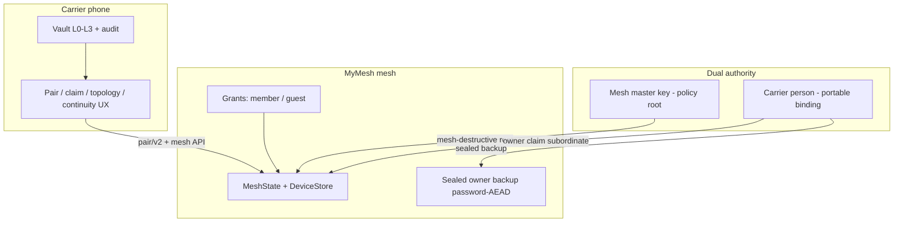
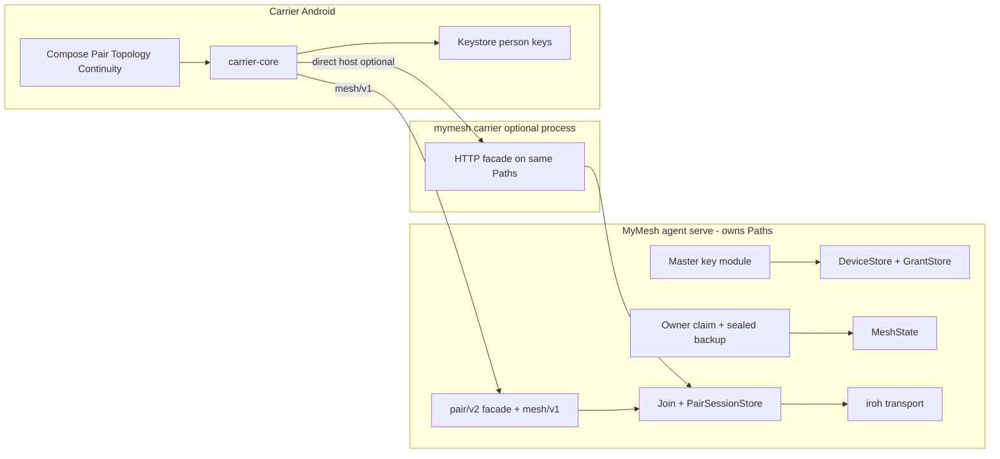

# MyMesh + Carrier Next Phase (S0–S9) — Design Document

| Field | Value |
|-------|--------|
| **Title** | MyMesh + Carrier: Internet-first pair, dual authority, owner/guest, continuity |
| **Author** | design skill |
| **Date** | 2026-08-12 |
| **Status** | Draft (rev 4 — open questions closed) |
| **Repos** | `~/Workspace/carrier`, `~/Workspace/MyMesh` |
| **Scope** | Full next phase after alpha.1 (slices S0–S9, waves A–E) |
| **Out of scope (implementation)** | GlassSpear site/agent work — parked as future consumer of Carrier identity/presence and Continuity packs |
| **Normative priors** | Carrier: `docs/PLATFORM.md`, `docs/TRUST-MODEL.md`, `docs/protocol/PAIR-HTTP.md`, `docs/protocol/PAIRING.md`, `docs/design/ALPHA-1.md`, `docs/THREATS.md`, `docs/FACETS.md`, `docs/RELATIONSHIP.md`. MyMesh: `docs/JOIN.md`, `docs/SECURITY.md`, `docs/THREATS.md` (S9 C1–C7), `docs/ARCHITECTURE.md`, `docs/ALPHA-3.md`, `docs/ROADMAP.md` |

---

## Overview

Alpha.1 shipped a working **LAN pair approval path**: MyMesh `mymesh carrier` exposes `/pair/v1` on port **17878**; Carrier Android (Compose + UniFFI + `carrier-core`) scans a `carrier://pair?…` QR, TOFU-checks `host_fingerprint`, polls `pending`, and L2-step-up `decide`s into MyMesh `JoinStore`. That path is real — and **LAN-bound**: `PairBootstrap.host` is required, `normalize_pair_host` only allows literal IP / `localhost` / `*.local`, and the QR embeds the host LAN IP. The product north star is different:

1. **MyMesh stands alone** — CLI pair + mesh master key; no Carrier required.
2. **Carrier is the person passport** — optional preferred UX and portable owner authority.
3. **Internet-first** — pair and ops work when devices are on different networks if both have internet; LAN host IP in a QR is an optional hint, never a hard requirement.
4. **Dual authority** — (a) mesh master password/key is **root of mesh policy**; (b) Carrier person claim is **portable person binding**, subordinate to MMK for mesh-destructive ops, with password-sealed person backup on mesh.
5. **Owner / guest / (later) federation** — personal mesh, share one device with a guest (no full roster leak), revoke cleanly; grant model allows later federation.
6. **Dual-scan ceremony** — scan machine A, scan machine B, acknowledge on phone; when phone cannot HTTP to either machine, **confirm-on-machine** is the **normative Wave A** zero-HTTP decide path; handoff completes over iroh between machines.
7. **Continuity pack v1** on Carrier for hotel-guest data path (MyMesh guest host) with wipe-on-leave; GlassSpear consumption is future shape only.
8. **Least placeholder** — no fake topology online, no claim without persistence, `mock-pair-host` demoted from primary demo.

This document freezes the **system model**, designs **S0–S9** with concrete APIs and data models against existing crates (`mymesh-session/src/carrier.rs`, `mymesh-session/src/join.rs`, `mymesh-core::{device,join,mesh}`, `carrier-core::{pair_client,wire::pair,identity,policy,audit}`, Android Pair/Identity screens), gives sequence diagrams, a **normative Wave A protocol appendix**, threat model, alpha.1 migration, and a dual-repo PR plan.

**Independence matrix**

| Mode | Required? | What works |
|------|-----------|------------|
| **MyMesh only** | Required path | Master key, CLI link/accept, guest grants via CLI, mesh gossip/topology local |
| **Carrier + MyMesh** | Preferred UX | Dual-scan, owner claim + sealed backup, topology UI, continuity pack, multi-identity |
| **GlassSpear later** | Optional consumer | Person identity + continuity packs; may later run without Carrier/MyMesh — **not designed here** |



### Wave A honesty (normative)

| Claim | Wave A truth |
|-------|----------------|
| Machines trust each other across NATs | **Yes** — existing iroh join completion (`JOIN.md` “Moving networks”) |
| Phone HTTP to private LAN IP not required | **Yes** — host optional in v2 QR |
| Phone posts decide over internet without reachable HTTP | **No in Wave A** — phone is not an iroh peer (KD16). Zero-HTTP decide = **confirm-on-machine** (or reverse-QR / short code on TUI) |
| Optional `host` direct decide | **Yes** when LAN/hint works (alpha.1-compatible) |
| Optional public relay decide | **Not Wave A** — S9 optional Class C |

**Product “internet-first pair” exit for Wave A** = dual-scan (phone captures both identities) + machines complete over iroh + decide via confirm-on-machine when phone cannot reach pair HTTP. That is not a placeholder: it is the complete ceremony.

---

## Background & Motivation

### What alpha.1 actually shipped (facts from code/docs)

| Area | Carrier | MyMesh |
|------|---------|--------|
| Pair | `pair_client.rs`: parse QR, host allowlist IP/.local, TOFU fp, Bearer poll/decide, L2 gate; **`v≠1` rejected** | `mymesh-session/src/carrier.rs`: arm-scoped bootstrap, JoinStore decide, QR with LAN `host=`; **separate process** from `mymesh serve`, shares `Paths` |
| Wire | `wire::pair` frozen; goldens | Local serde types mirrored to carrier-core |
| Identity | Person Ed25519, Keystore AES wrap (`HardwareWrapped` / `DegradedSoftware`) | Device Ed25519 in `identity.key`; no person/owner concept |
| Trust | Unlock L0–L2, audit **in-memory** | `DeviceRecord` Trusted/Pending/Revoked + capabilities |
| Caps | `Capability::default_grant()` = terminal/files/desktop/tcp — **no Admin** | `Capability::all()` same four; **Admin defined but never granted and never checked** in session path |
| Join accept | — | Host `take_decision` poll **200ms**; on Accept upserts Trusted + sends **full** `MembershipSnapshot` via `build_snapshot` (`join.rs`) |
| Mesh | No real topology UI | `MeshState`, membership gossip, kick |
| Continuity | Roadmap C2 only | N/A |
| Demo | `mock-pair-host`, `scripts/demo-pair.sh`, real MyMesh path | `mymesh carrier` + CLI join |

### Pain points driving S0–S9

1. **LAN host is required** — `PairBootstrap.host` is mandatory; phone on cellular cannot reach home desktop `:17878`.
2. **Single-host ceremony** — Dual-scan (scan A, scan B, acknowledge) is not modeled.
3. **No mesh master key** — Admin is “whoever can run local CLI.”
4. **No Carrier ownership** — Phone is not recorded as mesh owner; no sealed person backup.
5. **No guest model** — Accept always shares **full roster**; no one-device guest grant.
6. **Topology theater risk** — No real mesh API client on Carrier.
7. **Continuity not started**.
8. **mock-pair-host as primary demo** risk.

### Current pair data flow (alpha.1)

```mermaid
sequenceDiagram
  participant A as Machine A mymesh carrier
  participant P as Carrier phone
  participant B as Machine B mymesh link
  A->>A: Arm + mint bootstrap token
  A->>P: QR carrier://pair?host=LAN&token&fp&mesh
  P->>A: GET /pair/v1/status TOFU fp
  B->>A: JoinRequest over iroh when A is host target
  A->>A: JoinStore pending
  P->>A: GET pending Bearer
  P->>A: POST decide accept L2
  A->>A: JoinStore decision; auto-disarm
  Note over A,B: B completes trust; full membership snapshot
```

**Failure mode this phase removes:** step “QR host=LAN” as a **requirement**. Phone may still use host when present; internet path uses dual-scan + confirm-on-machine (Wave A) without inventing phone-as-iroh.

---

## Goals & Non-Goals

### Goals

| ID | Goal |
|----|------|
| G1 | Freeze contracts (S0) before feature code diverges — including Wave A protocol, mesh auth methods, guest membership rules |
| G2 | Internet-first **product** pair: dual-scan + iroh completion; LAN IP optional; Wave A zero-HTTP decide = confirm-on-machine |
| G3 | Dual-scan ceremony with real handoff (both device ids persisted trusted on the intended scope) |
| G4 | Mesh master key: create/unlock/rotate; CLI admin without Carrier |
| G5 | Carrier owner claim + sealed person backup on mesh + restore |
| G6 | Guest share one device + revoke without full mesh roster leak |
| G7 | Topology in Carrier from real mesh API (persisted roster) |
| G8 | Thin multi-identity (personal vs work) with real allowlists |
| G9 | Continuity pack v1 hotel-ready path (MyMesh host) + wipe on leave |
| G10 | Hardening: TLS/mesh-auth pair channel; recovery runbooks |
| G11 | MyMesh-only path remains first-class throughout |
| G12 | Deprecate required `host=` without breaking alpha.1 during transition |

### Non-goals

| Non-goal | Rationale |
|----------|-----------|
| GlassSpear attach production | Parked; contracts already in alpha.1 enough for later GS |
| Full federation / service hotel product | Model grants; implement later slices |
| Carrier as long-lived iroh mesh peer | Phone remains approval + vault, not agent |
| Phone → iroh pair mailbox for decide | Impossible without phone peer; Wave A uses confirm-on-machine |
| Full TUN VPN | MyMesh non-goal |
| iOS shell | Android first; UniFFI boundary preserved |
| TOTP / passkeys / wallet | C3–C5 later |
| Public multi-tenant MyMesh cloud IdP | Optional pair relay may exist S9; not mandatory |
| Fake online topology or mock as primary demo | Least-placeholder rule |

---

## System Model

### Nouns

| Noun | Definition | Persistence |
|------|------------|-------------|
| **Person** | Carrier vault identity (`PersonIdentity`: ULID `person_id`, Ed25519 pubkey, `key_backing`) | Phone Keystore-wrapped seed; optional sealed backup on mesh |
| **Identity facet** | Named person context: `personal` \| `work` (S7); each has own keys + mesh allowlist | Phone |
| **Device** | MyMesh node; `DeviceId` = Ed25519 pubkey bytes; words = BIP39 display | `identity.key`, `devices.json` |
| **Mesh** | Membership domain: `mesh_id` (UUID), roster, policy, optional owner claim | `mesh.json` + devices + new policy files |
| **Mesh master key (MMK)** | Password/key that wraps **Mesh Root Key (MRK)**; **root of mesh policy** | `mesh-master.json` (0600); MRK in agent memory only when unlocked |
| **Owner claim** | Binding: `person_id` + pubkey is **person-owner** of `mesh_id` (not a device role) | `mesh-owner.json` |
| **Sealed owner backup** | **Password-only** Argon2id + AEAD over person seed; MRK **not** required to decrypt | `owner-backup.sealed` mode 0600 |
| **Grant** | Authorization: subject device, object, role, capabilities, constraints | `grants.json` |
| **Device mesh role** | `member` \| `guest` only (never `owner` on a device) | `DeviceRecord.mesh_role` |
| **Person ownership** | Only in `mesh-owner.json` / topology `owner` object | Separate from device role |
| **Pair session** | Time-bounded dual-scan state (`sid`, arm, participants, phase) | `pair-sessions/<sid>.json` under agent `Paths` |
| **Pair endpoint class** | `direct` (optional host HTTP) \| `confirm` (Wave A default zero-HTTP) \| `relay` (S9 optional) | In bootstrap `ep` |
| **Topology snapshot** | Roster view for Carrier; authenticity via mesh-auth session (S6) + optional host sig (S9) | Derived from stores; never invented |
| **Continuity pack** | Bounded encrypted home subset + manifest | Phone; materialize on MyMesh host; wipe on leave |
| **Ceremony** | User-visible multi-step ritual | Audit events |

### Authorities

```text
                    ┌─────────────────────────────────────┐
                    │         Mesh administrative ops      │
                    │  accept member, kick, grant guest,   │
                    │  rotate MMK, clear/replace owner     │
                    └───────────────┬─────────────────────┘
                                    │
              ┌─────────────────────┼─────────────────────┐
              ▼                     ▼                     ▼
     ┌────────────────┐   ┌─────────────────┐   ┌──────────────────┐
     │ Mesh master key│   │ Local CLI on    │   │ Carrier person   │
     │ (MMK/MRK)      │   │ this host's     │   │ owner claim      │
     │ POLICY ROOT    │   │ filesystem      │   │ (subordinate for │
     │ always wins    │   │ (host-local     │   │ mesh-destructive)│
     │ mesh-destructive│  │ admin)          │   │ preferred UX     │
     └────────────────┘   └─────────────────┘   └──────────────────┘
```

**Authority invariants (normative):**

1. **MMK is root of mesh policy.** For mesh-destructive ops (clear owner, force rotate owner, emergency kick all, re-init mesh identity of policy files), MMK proof **wins** over owner and over remote Admin cap.
2. **Owner is portable person binding**, preferred for day-to-day remote admin (grants, topology, claim UX) after claim exists.
3. **Host-local CLI** (process with access to `Paths` data dir) is always able to administer **this node** (filesystem = root of trust on that machine). This is distinct from remote Admin cap.
4. **Remote Admin cap** (`Capability::Admin` on a Trusted **member** device) enables remote mesh API admin when granted; alpha.1 never grants it by default.
5. **Compromising a guest device** never yields MMK or person seed. **Sealed backup without password** does not yield person seed.

### Recovery matrix (dual authority)

| Lost | Still have | Recovery |
|------|------------|----------|
| Phone | Sealed backup + password | Restore person on new phone (S4); re-auth as owner |
| Phone + backup password | MMK | MMK clears/replaces owner (`DELETE /owner` or CLI); new claim |
| Phone + backup + MMK | — | Nuclear: new mesh / re-pair devices; old mesh_id abandoned |
| MMK password | Owner claim + working phone | **`mymesh mesh recover-master --owner-proof`**: owner signs challenge; rate-limited; generates **new MRK** and re-derives admin keys (old MRK destroyed). **Claim remains valid**; agent **rewrites `mesh-owner.json` `mrk_fingerprint`** to the new fingerprint (KD28). Optional `mrk_epoch` counter incremented for topology display. |
| MMK + owner phone | Sealed backup on disk + password | Restore phone first, then recover-master |
| MMK + owner + backup | Trusted member with host-local CLI | Host-local can still run node; **cannot** prove remote MMK; document “export MMK recovery codes at init” (print once) as recommended; else nuclear re-init policy files |

**MMK recovery codes (at `mesh init`):** 256-bit printed once (or 24 words), separate from daily password; hashes stored in `mesh-master.json` for `recover-master --code`. Owner proof path is additional when claim exists.

### Grant model (federation-ready shape)

```text
Grant {
  grant_id: ULID,
  mesh_id: UUID,
  subject_device_id: DeviceId,   // who receives access
  object: Device | Mesh | Service, // S5: Device only; later Service
  role: member | guest,            // NOT owner — person ownership is mesh-owner.json
  capabilities: [terminal, files, desktop, tcp, admin],
  constraints: {
    not_after: Option<DateTime>,
    max_sessions: Option<u32>,
    location_allowlist: Option<[LocationTag]>,  // S7 thin
    identity_facet: Option<personal|work>,
  },
  issued_by: DeviceId | PersonId | MasterKeyProof,
  issued_at: DateTime,
  revoked_at: Option<DateTime>,
}
```

S5: **object = one Device**, role = `guest`. S7 adds facet + location filters in session accept. Federation later adds object = Service.

### Ceremonies (catalog) — disambiguated

| Ceremony | Phone? | Commands / UX | Success |
|----------|--------|---------------|---------|
| **CLI link** | No | `connect-request allow` + `link` + `requests accept` | Both Trusted **members**; full roster snapshot (alpha.1) |
| **Single-host pair (v1/v2 direct)** | Yes if using Carrier decide; or CLI accept | Armed host + joiner link + phone HTTP decide **or** CLI | Member join + full snapshot |
| **Dual-scan** | **Required for scan UX** | `mymesh pair dual` / `dual --join` + phone Scan A/B | Bound session; then decide |
| **Confirm-on-machine** | Optional after scans (codes shown on phone) **or** operator-only without phone | `mymesh pair confirm <code>` | Session → decided; join completes |
| **Dual-scan + direct host** | Yes HTTP | POST `/pair/v2/decide` when `host` reachable | Same as confirm path outcome |
| **Master key bootstrap** | No | `mymesh mesh init` | MMK sealed; recovery codes printed |
| **Owner claim** | Yes (preferred) | Carrier claim UX **or** CLI with MMK | `mesh-owner.json`; optional backup |
| **Owner restore** | Yes | Backup file + password L3 | Same person_id keys |
| **Guest share** | Optional | `mymesh grant create` / Carrier share | Bilateral trust + Grant; **no full roster to guest** |
| **Guest revoke** | Optional | `grant revoke` | Grant revoked; sessions killed |
| **Continuity materialize / wipe** | Yes | Carrier Leave | Pack on host → wiped |
| **Kick** | Optional | `mymesh kick` | Member removed mesh-wide |

**Wording fix:** “MyMesh-only dual-scan” is **not** a thing. MyMesh-only = CLI link and/or operator `pair confirm` after identities known by other means. Dual-scan **scan UX** requires phone (or future camera on machine). Confirm-on-machine does **not** require the phone to stay online after codes are transcribed.

---

## Proposed Design

### High-level architecture after S9



**KD process ownership:** `PairSessionStore`, JoinStore, GrantStore live under agent **`Paths`**. `mymesh serve` is source of truth. `mymesh carrier` is an **optional HTTP facade** on the same disk state (alpha.1 pattern: carrier writes decisions, serve polls `take_decision` every 200ms). Wave A also adds **agent-integrated** `mymesh pair *` CLI so headless decide works **without** the carrier process.

### Control plane principle (internet-first) — revised

**Normative:** Device-to-device trust completion always uses **existing iroh dial-by-device-id**. The phone is **never** required to open TCP to a private LAN IP.

| Class | Wave | Phone decide transport | Notes |
|-------|------|------------------------|-------|
| **A. Direct** | A+ | HTTP(S) to optional `host` | alpha.1 path; LAN optimization |
| **B. Confirm** | **A primary zero-HTTP** | No phone network to host | Phone shows single-use confirm code(s); operator enters on resident (or joiner) TUI/CLI; machines finish over iroh |
| **C. Relay** | Optional later, **self-host only** (KD31) | HTTPS to operator-run relay | **Not** in Waves A–C; no public relay product |

**Deleted from design:** “Phone delivers signed decide via iroh pair mailbox.” Phone is not an iroh peer. After **one machine** receives confirm or HTTP decide, A↔B may gossip decision state over iroh if needed for dual participation — that is **machine↔machine**, not phone.

```text
Wave A decide priority on Carrier after dual-scan bound:
  1. If host hint present → try POST /pair/v2/decide (2s timeout)
  2. Else → show confirm codes (accept + deny codes); user runs
     mymesh pair confirm <code> on resident (default) or either participant
  3. Relay — not in Wave A
```

---

## S0 — Contract freeze

### Goals

Freeze nouns, versioning, error codes, Wave A protocol, mesh auth methods, guest membership rules, and independence matrix so S1+ PRs do not invent parallel schemas.

### Design

1. **Documents (normative, dual-repo):**
   - Carrier: `docs/protocol/PAIR-V2.md`, `MESH-API.md`, `OWNERSHIP.md`, `CONTINUITY.md`, `GUEST.md`; update `PAIR-HTTP.md` deprecation of required `host`.
   - MyMesh (this repo, PR A0): [`docs/MASTER-KEY.md`](MASTER-KEY.md), [`docs/GRANTS.md`](GRANTS.md), [`docs/GUEST.md`](GUEST.md), [`docs/PAIR-V2.md`](PAIR-V2.md); update [`JOIN.md`](JOIN.md), [`SECURITY.md`](SECURITY.md).
2. **Wire versioning:** v1 required host; v2 optional host + sid/did/ep.
3. **S0 must freeze (goldens / fixtures), not defer:**
   - `PairBootstrapV2` (incl. **nonce**), `SessionDecision`, confirm-code algorithm note
   - Canonical owner-claim preimage bytes
   - Grant JSON schema
   - Mesh API auth method enum + error codes for `/pair/v2` and `/mesh/v1`
   - Guest membership rule: **no full roster**
   - Argon2id parameter **ranges** (not final tunables) for MMK and backup
4. **Shared wire:** goldens in carrier-core; MyMesh mirrors (KD17). Shared crate revisit after Wave B if drift hurts.
5. **No UI fake data.**

### Wire stubs (S0 goldens)

```rust
pub struct PairBootstrapV2 {
    pub v: u32,                    // 2
    pub sid: String,               // ULID session
    pub did: String,               // host/resident device_id hex
    pub fp: String,
    pub mesh: Option<String>,
    pub token: String,             // arm-scoped bootstrap (32B b64url)
    pub nonce: String,             // REQUIRED: base64url of 16B session nonce (same bytes as PairSession + HMAC + SessionDecision)
    pub host: Option<String>,      // OPTIONAL direct hint
    pub ep: PairEndpointClass,     // direct | confirm | relay
    pub relay: Option<String>,
}

pub enum PairEndpointClass {
    Direct,
    Confirm,  // Wave A default when no reachable host
    Relay,
}

pub struct SessionDecision {
    pub sid: String,
    pub decision: PairDecision, // accept | deny
    pub joiner_device_id_hex: String,
    pub resident_device_id_hex: String,
    pub ts: String, // RFC3339
    pub nonce: String, // from session; binds decide
    pub person_id: Option<String>,
    pub sig_hex: Option<String>, // optional person sig Wave A
}

// Mesh API errors
pub enum MeshErrorCode {
    Unauthorized,
    Forbidden,
    NotFound,
    BadRequest,
    Conflict,      // e.g. owner already claimed
    RateLimited,
    Internal,
}

// Pair v2 errors: reuse PairErrorCode + SessionNotBound | SessionPhase
```

### Confirm-code algorithm (frozen in S0; implemented S2)

```text
pepper = bootstrap_token_raw (32B)  // arm-scoped; never leave machine except QR token to phone
material_accept = "mymesh-pair-confirm-v1" || 0x01 || sid || joiner_did || resident_did || nonce
material_deny   = "mymesh-pair-confirm-v1" || 0x00 || sid || joiner_did || resident_did || nonce
code_accept = base32(truncate(HMAC-SHA256(pepper, material_accept), 5 bytes))  // ~8 chars
code_deny   = base32(truncate(HMAC-SHA256(pepper, material_deny), 5 bytes))
```

- Phone computes codes **locally** after dual-scan bind using **token + nonce from QR_A** (no HTTP required on `ep=confirm`).
- **Canonical nonce encoding:** 16 raw bytes; wire as **base64url no padding** in QR (`nonce=`), `GET /pair/v2/status`, and `SessionDecision.nonce`; HMAC material uses the **raw 16 bytes** (not the ASCII base64url string).
- Status may still echo the same nonce for direct-path clients that re-fetch status (must match QR).
- Machine verifies with same formula; **single-use**: on success set `confirm_consumed=true` on session.
- Codes bind **exact** joiner_did; cannot accept a different pending JoinStore peer.
- Display: **Crockford base32 as 4-4 groups** (e.g. `ABCD-EFGH`). Ignore hyphens on input. (KD29; OQ1 closed).

### Argon2id parameter ranges (S0)

| Use | m (KiB) | t | p | Notes |
|-----|---------|---|---|--------|
| MMK wrap | 64_000–256_000 | 2–4 | 1–4 | Pick defaults in S3 impl; stay in range |
| Owner backup | 64_000–256_000 | 2–4 | 1–4 | Independent of MMK |

### Owner claim preimage (S0 golden)

```text
carrier-mesh-owner-v1 || u16le(len) || mesh_id_utf8
  || u16le(len) || person_id_utf8
  || person_pk_32
  || mrk_fingerprint_utf8
  || i64le(ts_unix)
```

### Guest membership rule (S0 freeze / KD)

**Guests do not receive mesh-wide `MembershipSnapshot`.** Guest onboarding writes **bilateral** DeviceRecords (object host ↔ guest) + Grant; guest `mesh_role=guest`. See S5.

### Mesh API auth methods (S0 freeze)

| Method | Key | Issues |
|--------|-----|--------|
| `mrk_proof` | MRK-derived admin Ed25519 or HMAC | Admin / destructive |
| `person_owner` | Person Ed25519 after claim | Owner UX |
| `device_member` | Device Ed25519 of Trusted **member** MyMesh node | Topology/CLI on that machine; **not** Carrier phone |
| `pair_read` | Bootstrap-bound read session post dual-scan | Carrier phone **minimal** topology only (Wave C); not full household |

### Done criteria

- [ ] Independence matrix + grant sketch + guest rule + auth methods in both repos.
- [ ] Goldens: v2 bootstrap, SessionDecision, claim preimage, grant JSON, error enums.
- [ ] Confirm-code algorithm documented; presentation **4-4 Crockford** (KD29).
- [ ] Deprecation table for required `host`.

---

## S1 — Pair control plane v2 (optional host + session store)

### Goals

Land **pair/v2** types, optional `host`, `PairSessionStore` on agent Paths, JoinStore bind hooks. **S1 alone does not claim “internet decide from phone.”** That exit is S2 (confirm-on-machine).

### Design

#### Bootstrap URL

```text
# v1 (alpha.1, still accepted)
carrier://pair?v=1&host=<url>&token=<b64url>&fp=<fp>&mesh=<id>

# v2
carrier://pair?v=2&sid=<ulid>&did=<64hex>&token=<b64url>&nonce=<b64url-16B>&fp=<fp>
                 &ep=direct|confirm|relay
                 &host=<optional>
                 &mesh=<optional>
                 &relay=<optional>
```

Carrier `parse_pair_qr`:

- `v=1`: current behavior (`host` required; no nonce).
- `v=2`: `host` optional; **`nonce` required** (base64url 16B); if host absent, mode=`confirm` (or explicit `ep=confirm`).
- Do not fail parse when host absent on v2; **do** fail parse when v2 nonce missing/malformed.

#### PairSessionStore (agent Paths)

```text
# paths.data_dir/pair-sessions/<sid>.json  mode 0600
PairSessionFile {
  sid, mesh_id,
  resident_device_id,   // did from QR / host
  token_hash,           // SHA-256 of raw token (store hash only on disk)
  nonce: [u8; 16],      // random per session; REQUIRED in QR_A + status + SessionDecision (same bytes)
  until: DateTime,
  joiner_device_id: Option,
  joiner_label: Option,
  joiner_fp: Option,
  phase: PairPhase,
  decision: Option<JoinDecision>,
  confirm_consumed: bool,
  created_at, updated_at
}

PairPhase =
  armed | bound | decided | completing | completed | failed_partial | expired
```

#### Endpoints

```text
GET  /pair/v2/status          # public: sid, ep, mesh, fp, armed, protocol_version=2, nonce (echo of QR; not required on ep=confirm)
GET  /pair/v2/pending         # Bearer; lists pending joins **bound to this sid** only
POST /pair/v2/decide          # Bearer + SessionDecision body; verifies joiner bound
POST /pair/v2/session/bind    # machine-local or Bearer: bind joiner did to sid
```

v1 endpoints remain (compat).

#### Join integration (must land with S1/S2 machine work)

In `handle_join_as_host` (`join.rs`):

1. When PairSession exists in `armed|bound` and pending joiner arrives, **bind** `joiner_device_id` to session if not set (or verify match).
2. `take_decision` path: if session present, only accept decision for **bound** joiner_did; ignore/reject decisions for other device ids.
3. Carrier HTTP and `mymesh pair confirm` both write JoinStore decision **and** session phase `decided`.

#### Carrier client (S1)

- Parse v2; open session draft without requiring host.
- If host present: status TOFU + pending poll (alpha.1 behavior).
- If host absent: **do not** spin forever on HTTP; UI state `AwaitingConfirm` only after S2 dual-scan binds joiner (S1 may show “scan second device or use LAN host”).
- **Ship gate for A4:** UI must always expose a completion path: direct host **or** confirm codes (requires A5 same milestone / merged).

### Data model / process

- Store under agent Paths; carrier process is facade.
- `mymesh pair status` reads same files without HTTP.

### Done criteria (S1 only)

- [ ] v2 QR without `host` parses on Carrier; does not crash.
- [ ] v1 QR still works on LAN.
- [ ] PairSessionStore persists; QR_A and status carry same nonce; parse fails if v2 missing nonce.
- [ ] JoinStore bind: decision for wrong device id does not accept wrong peer.
- [ ] **Not required for S1 exit:** phone-on-cellular completes decide without confirm path (that is S2).

### Explicit non-placeholders

- Do not advertise “Internet pair complete” in UI until confirm path works (S2).
- Do not log tokens.

---

## S2 — Dual-scan ceremony + confirm-on-machine (internet-first UX exit)

### Goals

Scan A, scan B, L2 acknowledge on phone; complete trust via (1) direct POST if host reachable **or** (2) **confirm-on-machine** (normative zero-HTTP). Both DeviceStores reach intended trust state with real persistence.

### Dual-scan UX

```text
1. Machine A (resident): mymesh pair dual
   → PairSession sid; QR_A v2 (sid, did_A, fp_A, token, **nonce**, mesh, ep=confirm|direct, host?)
2. Machine B (joiner): mymesh pair dual --join --resident <did_A|words>
   → starts iroh join toward A when armed; shows QR_B (did_B, fp_B, label) for phone
3. Phone: Scan A → SessionDraft; Scan B → bind joiner; show both fps/words → L2 Accept/Deny
4a. If host reachable: POST /pair/v2/decide with SessionDecision
4b. Else: show code_accept / code_deny; user: mymesh pair confirm <code> on A
5. A writes JoinStore decision for bound joiner only; phase decided → completing
6. Existing join loop take_decision → JoinAccept; B Trusted on A
7. B applies host trust; **member** path sends membership snapshot; see role
8. phase completed; audit on phone if used
```

### Sequence: dual-scan + confirm-on-machine (normative Wave A internet path)

```mermaid
sequenceDiagram
  participant A as Machine A resident serve
  participant B as Machine B joiner
  participant P as Carrier phone
  A->>A: PairSession armed sid nonce token
  A->>P: QR_A v2 includes nonce; no host required
  P->>P: Scan A store draft
  B->>A: JoinRequest iroh when B dials A
  A->>A: JoinStore pending; bind joiner to sid
  B->>P: QR_B did_B fp_B
  P->>P: Scan B; show both fps; L2 Accept
  P->>P: Compute code_accept locally
  P-->>A: User types mymesh pair confirm CODE
  A->>A: Verify HMAC binding; phase decided
  A->>A: write_decision Accept for bound joiner only
  A->>B: JoinAccept + snapshot if member
  B->>B: DeviceStore Trusted A
  A->>A: phase completed
```

### Sequence: dual-scan + direct host (LAN optimization)

```mermaid
sequenceDiagram
  participant A as Machine A
  participant B as Machine B
  participant P as Carrier
  P->>P: Dual-scan bound L2 Accept
  P->>A: POST /pair/v2/decide Bearer SessionDecision
  A->>A: verify token, sid, bound joiner, nonce
  A->>A: write_decision; phase decided
  A->>B: JoinAccept via existing join path
```

### SessionDecision verification (HTTP path)

1. Bearer token ct_eq current arm token.
2. `sid` matches open session.
3. `joiner_device_id_hex` == session.joiner_device_id (must be bound).
4. `resident_device_id_hex` == session.resident_device_id.
5. `nonce` matches session.nonce (anti-replay across sessions).
6. `ts` within skew ±5 min.
7. Idempotent: if phase already `decided|completing|completed` with same decision+joiner → return ok; if different decision → conflict.
8. Optional person `sig_hex` over canonical SessionDecision bytes — audit only in Wave A.

### Handoff state machine

| Phase | Entry | Exit success | Exit failure | Operator recovery |
|-------|-------|--------------|--------------|-------------------|
| `armed` | `pair dual` / arm | joiner bound | arm TTL → `expired`; confirm with 0 pending → **not_bound** (fail closed, stay armed) | re-arm new sid; retry confirm after dial |
| `bound` | joiner_did set (scan B or join pending) | decide accept/deny | expire | re-bind if wrong peer: deny + new session |
| `decided` | confirm or POST decide | join loop consumes | — | — |
| `completing` | Accept taken by host loop | JoinAccept sent + local Trusted | iroh fail → `failed_partial` | `mymesh pair retry <sid>` re-sends accept if local Trusted already; else re-link |
| `completed` | both sides Trusted (member) or bilateral guest trust | — | — | — |
| `failed_partial` | one-sided trust detected | retry succeeds | timeout | `pair retry`; manual `requests` / revoke stale |
| `expired` | until < now | — | — | new session |

**Partial trust algorithm:**

- Resident on Accept: upserts joiner Trusted (alpha.1).
- Joiner on JoinAccept: upserts resident Trusted.
- If B never receives Accept: A has Trusted B, B does not → `failed_partial` after `completing` timeout (default 120s).
- `pair retry`: if session decided accept and local record Trusted, re-dial joiner with JoinAccept+snapshot once; if joiner already Trusted, no-op.
- Deny: clear pending; neither side gains new Trusted for that pair attempt.

### Confirm CLI

```bash
mymesh pair dual
mymesh pair dual --join --resident <id>
mymesh pair status [--sid]
mymesh pair confirm <code>   # verifies HMAC; single-use
mymesh pair retry <sid>
```

### Done criteria

- [ ] Two real agents complete Trusted after dual-scan + confirm **without** phone HTTP to host.
- [ ] Dual-scan + direct host still works on LAN.
- [ ] Deny leaves joiner not Trusted.
- [ ] Wrong confirm code for different joiner fails; cannot accept unbound peer.
- [ ] Replay of old SessionDecision (wrong nonce/sid) fails.
- [ ] Audit (phone) includes both peer fingerprints, not words/tokens.
- [ ] CLI link without phone still works (unchanged ceremony).
- [ ] Confirm-on-machine works operator-only if fps compared out-of-band (no dual-scan phone).
- [ ] Confirm with zero pending returns `not_bound` (fail closed, no hang); succeeds after single pending bind.
- [ ] QR_A without nonce rejected by Carrier parse (v2).

### Explicit non-placeholders

Handoff must use JoinStore + DeviceStore upsert — not UI-only “linked” on phone.

### Risks

| Risk | Severity | Mitigation |
|------|----------|------------|
| User scans wrong second device | High | Dual chrome; both fps; short TTL |
| Partial completion | High | State machine + retry |
| Confirm code shoulder-surf | Med | Short TTL; single-use; deny code separate |
| QR size | Med | words not in QR |

---

## S3 — Mesh master key (standalone)

### Goals

MyMesh owns itself without Carrier: MMK/MRK; admin recovery; policy root.

### Cryptography

| Item | Choice |
|------|--------|
| KDF | Argon2id within S0 ranges |
| Wrap | XChaCha20-Poly1305 over 32-byte **MRK** |
| MRK HKDF labels | `mymesh/mrk/admin-sign`, `mymesh/mrk/admin-mac` — **not** person-backup key |
| Sealed person backup | **Independent** password-AEAD (S4); MRK does **not** encrypt person seed |
| Recovery codes | 256-bit; hash stored; print once at init |

```text
mesh-master.json (0600)
{
  "kdf": "argon2id",
  "kdf_params": { "m": 65536, "t": 3, "p": 1 },
  "salt": "<b64>",
  "wrap_alg": "xchacha20poly1305",
  "nonce": "<b64>",
  "wrapped_mrk": "<b64>",
  "mrk_fingerprint": "<8 hex>",
  "recovery_code_hashes": ["<hex>", ...],
  "created_at": "...",
  "rotated_at": null
}
```

### CLI

```bash
mymesh mesh init                 # password + print recovery codes
mymesh mesh unlock | lock | status
mymesh mesh rotate-master
mymesh mesh recover-master --code <recovery>
mymesh mesh recover-master --owner-proof  # after S4 claim; signs challenge
```

**After recover-master (normative):**

1. New MRK wrapped with new password (or re-entered password); old wrap invalidated.
2. If `mesh-owner.json` exists: update `mrk_fingerprint` to new value; set `mrk_epoch += 1` if field present (default 0→1). **Do not** clear person claim — ownership is person binding, not MRK bytes.
3. Topology `mrk_fingerprint` comes from live `mesh-master` / mesh state after unlock, so UI matches without forced re-claim.
4. Sealed owner backup unchanged (password-AEAD independent of MRK).

### MMK unlock policy (normative — OQ2 closed)

| Mode | Default? | Behavior |
|------|----------|----------|
| **Re-prompt** | **Yes** | Agent start / after lock: operator enters MMK password (or recovery). MRK only in process memory. |
| **Opt-in OS keyring** | No | User explicitly enables store-of-unwrapped-MRK or password in platform keyring (e.g. secret-service / keychain) for unlock-on-boot / unlock-on-serve. Document threat: physical access to unlocked OS session. Disable returns to re-prompt. |

Never enable keyring by default in `mesh init`.

### Authorization (with host-local rule)

| Actor | Can |
|-------|-----|
| Host-local CLI (data dir access) | Always configure this node; write grants/kick local; unlock MMK interactively |
| MRK unlocked / proof | Mesh-destructive + remote admin API |
| Person owner session | Day-to-day remote admin; **not** clear owner without MMK (or recover-master path) |
| Device with `Capability::Admin` | Remote grant/kick as allowed; not clear MMK |
| Device without Admin | Session caps only; topology read if member |

### Admin capability migration (existing meshes)

1. **Host-local CLI always retains node admin** (filesystem trust) — no change to “I can kick from the machine I’m on” via CLI reading local store.
2. **Remote/API admin** requires Admin cap **or** MMK proof **or** owner session.
3. **Upgrade migration:** on first load after upgrade, if `mesh-master.json` missing, do not break sessions. When `mesh init` runs, creator device record gets `capabilities` including `Admin` and `mesh_role=member`.
4. **Existing Trusted devices:** keep capabilities as stored (no Admin). Operators use host-local CLI or MMK after init to `mymesh devices grant-admin <id>` (host-local or MMK).
5. Document in JOIN/SECURITY: default grant remains **without** Admin (matches `Capability::all()` today).

### Done criteria

- [ ] init → unlock → admin proof works without Carrier.
- [ ] Wrong password fails closed; recovery code works once-configured.
- [ ] Agent restart forgets MRK until unlock by **default** (re-prompt). **Opt-in OS keyring** may unlock-on-boot when user enables it (KD30).
- [ ] Runbook stub includes lost-MMK + owner path.
- [ ] Unit tests wrap/unwrap + HKDF labels; **no** person seed in MRK hierarchy tests.

---

## S4 — Carrier owner claim + sealed backup + restore

### Goals

Portable person authority subordinate to MMK; sealed backup; restore.

### First claim rule (normative)

**Owner claim requires MMK authorization on the mesh agent** (policy root). Order: **S3 before claim (Wave B)**. Fresh mesh: `mesh init` → unlock → claim.

**Critical: MMK password / MRK never leave the machine. Carrier phone never receives or stores MMK material.** Phone sends **person signature only**.

#### Normative claim authorization patterns (pick both; first preferred)

| Pattern | How | When |
|---------|-----|------|
| **1. Agent co-sign (preferred)** | Operator has `mymesh mesh unlock` so MRK is in **serve process memory**. Phone `POST /mesh/v1/owner/claim` body = person-signed claim only. Agent verifies person sig, then **attaches local MRK proof server-side** and writes `mesh-owner.json`. If MRK locked → **403 `mmk_locked`** with copy: unlock on agent or open claim window. | Day-to-day Carrier claim UX |
| **2. CLI claim window** | `mymesh owner allow-claim --secs 300` (requires unlocked MMK or recovery). Writes `claim-window.json` { until, nonce }. Phone posts person-signed claim; agent accepts if window valid **without** live MRK in memory after window mint (window file is MMK-authorized capability, mode 0600). | Headless / unlock-then-leave |
| **3. CLI-only claim** | `mymesh owner claim --person-pubkey … --sig-file …` on the machine (MMK unlocked). Phone only does backup upload later with person_owner session. | Air-gap / recovery |

**Forbidden:** sending MMK password, recovery codes, or MRK bytes to the phone; “mmk_proof” field fabricated on the client.

Auth matrix for `POST /owner/claim`: person sig **required** from phone; MMK satisfaction is **agent-local** (co-sign or window), not a phone-held proof.

### Owner claim file

```text
mesh-owner.json
{
  "mesh_id": "...",
  "person_id": "...",
  "person_public_key_hex": "...",
  "display_name": "...",
  "claimed_at": "...",
  "claimed_from_device_id": "...",  // device that hosted the API; NOT role=owner
  "mrk_fingerprint": "...",         // updated on recover-master (KD28)
  "mrk_epoch": 0,                     // incremented on recover-master
  "claim_sig_hex": "..."            // person signs S0 preimage (original claim; not invalidated by epoch)
}
```

Re-claim / clear: **MMK required** (policy root). Owner cannot DELETE self without MMK (prevents locked-out stuck state without recovery path — use recover-master first if MMK lost).

### Sealed backup (password-AEAD only)

```text
owner-backup.sealed
{
  "version": 1,
  "person_id": "...",
  "kdf": "argon2id",
  "salt": "...",
  "wrap_alg": "xchacha20poly1305",
  "nonce": "...",
  "ciphertext": "...",   // 32B seed + meta
  "created_at": "...",
  "hint": "optional"
}
```

- Decrypt with user backup password only.
- **MRK does not wrap this blob.** Optional second layer deferred (not in S4).
- Distinct from phone biometrics and recommended distinct from MMK password.

### Mesh API (auth per matrix)

```text
POST /mesh/v1/owner/claim      # person sig; agent co-sign MRK or claim-window (phone never holds MMK)
GET  /mesh/v1/owner            # public meta (any mesh session)
PUT  /mesh/v1/owner/backup     # person_owner session
GET  /mesh/v1/owner/backup     # person_owner | mrk_proof | recovery token
DELETE /mesh/v1/owner/claim    # mrk_proof only
```

### Sequence: claim + backup

```mermaid
sequenceDiagram
  participant P as Carrier
  participant M as MyMesh agent
  participant D as Disk
  Note over M: Operator: mymesh mesh unlock (MRK in agent memory)
  P->>M: GET /mesh/v1/auth/challenge
  M-->>P: nonce methods_allowed includes person_owner
  P->>P: L2/L3; sign claim preimage (person key only)
  P->>M: POST /owner/claim person_sig only
  M->>M: verify person sig; co-sign with local MRK or claim-window
  alt mmk_locked
    M-->>P: 403 mmk_locked
  else ok
    M->>D: mesh-owner.json
  end
  P->>P: password-AEAD seal seed
  P->>M: PUT /owner/backup
  M->>D: owner-backup.sealed 0600
  P->>P: audit OwnerClaim BackupStored
```

### Done criteria

- [ ] Claim without MMK rejected.
- [ ] Second claim rejected without MMK clear.
- [ ] Backup restore same person_id + pubkey.
- [ ] Backup without password useless.
- [ ] recover-master --owner-proof works when claim exists; `mrk_fingerprint` on owner file updates without re-claim.
- [ ] CLI export/import sealed blob without phone.

---

## S5 — Guest share one device + revoke

### Goals

Share **one device** with a guest; clear member vs guest; **no full mesh roster to guest**; revoke ends access.

### Guest onboarding protocol (normative)

**Not** the normal member join path (which calls `build_snapshot` of all trusted devices in `join.rs`).

```text
GuestInvite ceremony:
1. Owner/admin creates Grant (subject=guest_did or pending, object=host_did, role=guest, caps, not_after).
2. Guest pairs **only to object host** via:
   a) mymesh link <object-host-id> while host armed with --guest-grant <grant_id>
      OR
   b) dual-scan with session.flag guest=true and grant_id bound
3. On Accept for guest session:
   - Object host upserts DeviceRecord { mesh_role: guest, capabilities: grant.caps, trust: Trusted }
   - Send JoinAccept **without** MembershipSnapshot
     (new wire: JoinAccept stays; omit snapshot frame OR send MembershipSnapshot with members=[host only] + role guest)
   - Guest upserts only the object host as Trusted member-of-bilateral (mesh_role guest on guest’s store for host)
4. Guest MUST NOT be inserted into mesh-wide gossip roster as a full member.
5. mesh sync / build_snapshot **filters out** mesh_role=guest from snapshots sent to members? 
   - Members do not need guest list by default; object host keeps guest in local DeviceStore.
   - Optional: members learn guest ids only if policy allow (default no).
```

**Wire delta (explicit PR):**

| Message | Change |
|---------|--------|
| `JoinAccept` | unchanged crypto |
| `MembershipSnapshot` after guest accept | **skip** or single-host only |
| `GrantAnnounce` / `GrantRevoke` (new ControlMessage) | gossip revoke to object host replicas if any; not full guest identity flood |
| `build_snapshot` | exclude `mesh_role=guest` from member snapshots |

### DeviceRecord

```rust
pub enum MeshRole {
    Member,
    Guest,
}
// Default for existing Trusted: Member
// Person ownership is NOT a MeshRole
```

### Session enforcement

```text
allows(peer, cap):
  if peer.trust != Trusted: deny
  if peer.mesh_role == Guest:
    require active Grant covering this node as object with cap
    check not_after, facet constraints
  else:
    peer.capabilities.contains(cap)  // member path (alpha.1)
```

### CLI / API

```bash
mymesh grant create --to <guest> --on <device> --caps terminal,files --days 7
mymesh grant list | revoke <grant_id>
```

```text
POST /mesh/v1/grants
GET  /mesh/v1/grants
POST /mesh/v1/grants/{id}/revoke
```

Authz: person_owner | mrk_proof | device_member with Admin | host-local CLI.

### Revoke vs kick

| | Grant revoke | Kick |
|--|--------------|------|
| Scope | One grant / object access | Mesh-wide member removal |
| Guest | Primary tool | N/A (guest not full member) |
| Member | Rare (if grant-shaped later) | Primary |

Revoke: `revoked_at`; kill sessions subject→object; `GrantRevoke` notice; audit.

### Sequence: guest share + revoke

```mermaid
sequenceDiagram
  participant O as Owner
  participant H as Object host
  participant G as Guest device
  O->>H: grant create guest→H
  G->>H: join guest path
  H->>H: Trusted guest role; no full snapshot
  H-->>G: JoinAccept only
  G->>H: session with grant caps
  O->>H: grant revoke
  H->>H: kill sessions; revoked_at
```

### Done criteria

- [ ] Guest cannot list other mesh members via snapshot/gossip.
- [ ] Guest caps enforced; other devices deny guest sessions.
- [ ] Revoke kills access ≤60s.
- [ ] CLI-only path without Carrier.
- [ ] Protocol tests: guest accept does not call full `build_snapshot`.

---

## S6 — Topology in Carrier (real mesh API)

### Goals

Real roster from API/store; never fabricated.

### Topology response

```text
GET /mesh/v1/topology
Authorization: mesh session (see auth matrix)
→ {
  "mesh_id": "...",
  "mrk_fingerprint": "...",
  "owner": { "person_id", "display_name" } | null,
  "roster_generation": 42,
  "members": [ { device_id_hex, label, fingerprint, short_id,
                 mesh_role, capabilities, trust, last_seen, aliases, groups } ],
  "grants_summary": [ ... ],
  "served_by_device_id_hex": "...",
  "snapshot_sig_hex": null,   // optional until S9
  "auth_mode": "device_member" | "person_owner" | "mrk_proof" | "pair_read"
}
```

**Authenticity (Wave C):** Topology is served only over **authenticated mesh session** (challenge-response). Cleartext MITM without session keys cannot call API. `roster_generation` is cache bust, **not** standalone authenticity. **S9:** optional `snapshot_sig_hex` = host device Ed25519 over canonical topology body for pinning/TOFU display.

**Client classes (do not conflate):**

| Client | Keys available | Topology path |
|--------|----------------|---------------|
| **Carrier phone** | Person Ed25519 only (not a mesh device; KD16) | **Full roster:** `person_owner` after claim. **Before claim:** only `pair_read` (session-minimal) or no topology UI beyond dual-scan participants. **Never** `device_member`. |
| **MyMesh node / CLI** on Trusted member | Device Ed25519 (`identity.key`) | `device_member` → full member roster (grants if Admin/own) |
| **Agent with MRK unlocked** | MRK-derived | `mrk_proof` → full + admin |

**Who can read (by auth method):**

| Auth | Client that uses it | Sees |
|------|---------------------|------|
| person_owner | Carrier after claim | Full member roster + grants |
| mrk_proof | Unlocked agent / recovery tools | Full + admin |
| device_member | MyMesh laptop/CLI only | Full member roster; grants if Admin/own |
| pair_read | Carrier post dual-scan (short TTL) | **Minimal only:** mesh_id, that session's resident+joiner, generation — **not** full household |
| guest device session | Guest MyMesh node | Self + object host only |

**Product copy:** Carrier “Meshes” full household view requires owner claim (or explicit future elevated session — not Wave C). Pre-claim Carrier may show dual-scan session summary via `pair_read` only.

### Carrier cache

Label stale cache with `fetched_at` + generation; never invent members. Offline: show cache + “offline”, not green-online lies.

### Done criteria

- [ ] Pair/kick/grant reflect after refresh.
- [ ] Empty mesh empty; no sample devices in production nav.
- [ ] Guest token cannot pull full roster.

---

## S7 — Multi-identity (thin but real)

### Goals

Personal vs work facets with **real** allowlists.

### Design

```text
IdentityFacet {
  facet_id, kind: personal|work,
  person: PersonIdentity,  // separate key tree
  mesh_allowlist: [mesh_id],
  device_allowlist: [device_id],
  location_tags_allow: [tag],
}
```

- Pair decide / claim / continuity require active facet.
- Grant may carry `identity_facet`; agent enforces when present.
- **Ship rule:** Carrier allowlist UI (**E1**) and MyMesh enforcement (**E2**) **same release** — no cosmetic-only allowlists (KD25).

### Done criteria

- [ ] Two facets two keypairs; allowlist fail-closed.
- [ ] Audit records facet id.

---

## S8 — Continuity pack v1 (hotel-ready MyMesh host)

### Goals

Bounded pack to a **MyMesh device** (guest grant or owner host); wipe on leave. GlassSpear materialize is **future-compatible shape only** — not required.

### Crypto

```text
1. Phone generates random pack_key 32B
2. encrypted_payload = XChaCha20-Poly1305(pack_key, plaintext fields)
3. wrap = seal pack_key to host device Ed25519 pubkey
   (crypto_box / HPKE-style; exact: X25519+XChaCha20-Poly1305 sealed box from device pk)
4. Materialize body: { pack_id, wrap, ciphertext, manifest, wipe_token_hash }
5. Host unwraps with device private key; stores payload in cache dir
```

Field granularity v1: encrypt whole `fields` JSON as one AEAD (not per-field).

### Authz materialize

- Caller: person_owner session **or** subject of active Grant to this host with continuity capability (v1: owner-only materialize; guest host = device you own in hotel bag running MyMesh).
- Product story: **hotel-ready data path on a MyMesh node you control or were granted**, not untrusted hotel TV GlassSpear (GS parked).

### Wipe

```text
POST /mesh/v1/continuity/wipe { pack_id, wipe_token }
```

- Best-effort: overwrite file contents with zeros once + unlink; fsync parent dir. No guarantee against forensic FS on all platforms — document limitation.
- Status: present | wiped | absent.

### Size budget

≤ 1 MiB ciphertext v1.

### Done criteria

- [ ] Materialize real files; wipe removes (test absence).
- [ ] Without wipe_token/owner, wipe fails.
- [ ] pack_key never logged; only host private key unwraps.
- [ ] GS not required.

---

## S9 — Hardening

### Goals

TLS/mesh-auth, rate limits, persistent audit, runbooks, deprecation.

### Rate limits & metrics (defaults)

| Endpoint / event | Limit | Metric |
|------------------|-------|--------|
| pair decide / confirm | 10 / min / token | `pair_decide_total{result}` |
| pair status unauth | 60 / min / ip | `pair_status_total` |
| mesh auth challenge | 30 / min / ip | `mesh_auth_challenge_total` |
| backup unwrap attempts | 5 / 15 min / person_id | `owner_backup_unwrap_total{result}` |
| grant mutate | 30 / min / session | `grant_mutate_total` |

Metrics dir: extend MyMesh `paths.metrics_dir` JSON counters (existing metrics pattern).

### Other

1. Optional TLS pin in QR `tlspin=` for direct ep; release cleartext policy unchanged (Carrier release denies cleartext).
2. Topology optional `snapshot_sig_hex`.
3. Persistent Carrier audit log redacted.
4. Runbooks: lost phone; lost MMK; compromised guest; MMK leak rotate; restore owner from sealed backup — MyMesh ops: **[RECOVERY.md](RECOVERY.md)** (B7-m).
5. mock-pair-host lab-only; DEMO-PAIR real MyMesh dual-scan+confirm — see [DEMO-PAIR.md](DEMO-PAIR.md).
6. **QR default policy (single KD):** After A3, `mymesh pair dual` emits **v2**. After **D5**, `mymesh carrier` also defaults to **v2** (LAN `host` + `ep=direct`); `--pair-v1` remains the alpha.1 LAN escape.
7. **Relay (KD31):** Optional Class C is **self-hosted only** if ever implemented; not a product deliverable in Waves A–E. No public MyMesh pair relay.

### S9 control checklist (threat → control id)

| ID | Threat | Control |
|----|--------|---------|
| C1 | Session fixation | token+sid+nonce+TTL |
| C2 | Wrong joiner accept | bind joiner_did + confirm HMAC |
| C3 | Backup theft | password Argon2id AEAD |
| C4 | Guest residual | wipe + grant revoke |
| C5 | Topology MITM | mesh-auth session; optional sig S9 |
| C6 | Facet bleed | allowlists enforced S7 |
| C7 | Decide brute force | rate limits above |

**Operator-facing expansion (implemented vs planned in this tree):** [THREATS.md](THREATS.md) · [SECURITY.md](SECURITY.md).

---

## API / Interface Changes (summary)

### Pair bootstrap

| | alpha.1 (v1) | Next (v2) |
|--|--------------|-----------|
| `host` | **Required** | **Optional** |
| `sid` / `did` / `ep` | — | Required |
| Zero-HTTP decide | — | confirm codes |
| Endpoints | `/pair/v1/*` | `/pair/v2/*` + v1 compat |

### Mesh API auth matrix (routes)

| Route | mrk | person_owner | device_member | pair_read | host-local |
|-------|-----|--------------|---------------|-----------|------------|
| GET topology | full | full | full members | session-minimal | full |
| POST owner/claim | agent co-sign / window | person sig only | no | no | allow-claim / claim CLI |
| DELETE owner | required | no | no | no | + mmk |
| PUT/GET backup | get | put/get | no | no | export CLI |
| grants mutate | yes | yes | if Admin | no | yes |
| continuity mat/wipe | yes | yes | object host only | no | yes |

### UniFFI SensitiveOp additions

```rust
OwnerClaim, RestoreFromBackup, // L3 restore
GrantGuest, RevokeGrant,       // L2
ContinuityMaterialize, ContinuityWipe, // L2
// ExportBackup already L3
```

### CLI additions

```text
mesh init|unlock|lock|status|rotate-master|recover-master
pair dual|confirm|status|retry
grant create|list|revoke
owner claim|allow-claim|show|backup export|import
continuity status|wipe
devices grant-admin <id>
```

---

## Data Model Changes

### MyMesh files

| File | Mode | Slice |
|------|------|-------|
| `mesh-master.json` | 0600 | S3 |
| `mesh-owner.json` | 0600 | S4 |
| `owner-backup.sealed` | 0600 | S4 |
| `grants.json` | 0600 | S5 |
| `pair-sessions/<sid>.json` | 0600 | S1–S2 |
| `continuity/<pack_id>/` | 0700 | S8 |
| `mesh.json` | + `mrk_fingerprint?` | S3 |
| `devices.json` | + `mesh_role?: member\|guest` | S5 |

Migration: missing `mesh_role` → `Member` if Trusted. Capabilities unchanged (still no Admin unless granted).

### Carrier local

Facet store (S7), topology cache (S6), persistent audit (S9), continuity drafts (S8).

---

## Alternatives Considered

### Alt 1: Public mandatory pair cloud relay
Reject entirely as product. Optional later: **self-host only** (KD31); Waves A–C do not depend on it.

### Alt 2: Carrier becomes full iroh mesh peer
Reject; PLATFORM/battery; KD16.

### Alt 3: Keep LAN-only pair; require VPN
Reject as primary.

### Alt 4: MMK only, no Carrier owner
Reject; lose portable person passport.

### Alt 5: Encode full pending join in QR only
Reject pure-QR; hybrid dual-scan + confirm/direct.

### Alt 6: Confirm-only phone (no phone HTTP ever) — **accepted as Wave A primary shape**
Phone is camera + code display; machines do iroh. Direct HTTP remains LAN optimization, not required. Matches Issue 1 resolution.

### Alt 7: Fold pair HTTP into iroh for machines only
Compatible with Alt 6; carrier HTTP optional facade. Prefer keep HTTP for LAN phone decide convenience.

### Alt 8: Shared wire crate in S0
Defer; golden-mirror (KD17) until Wave B churn settles; revisit if drift burns.

### Alt 9: Single authority (owner = MMK personified)
Reject dual-authority north star; recovery matrix needs both.

---

## Security & Privacy Considerations

### Threat model

| Threat | Impact | Control | Slice |
|--------|--------|---------|-------|
| Attacker joins as device | Shell/files | Dual-scan fps; short arm; bind joiner; revoke | S2, S5 |
| LAN MITM pair HTTP | Token theft | Confirm path without phone HTTP; S9 TLS | S2, S9 |
| Stolen phone L1 | Pair UI | L2 decide; L3 restore | existing |
| Stolen sealed backup | Identity if weak pw | Argon2id; rate limit C7 | S4 |
| Stolen mesh-master + pw | Full admin | Strength; recovery codes; rotate | S3 |
| Guest retains data | Privacy | Wipe + grant revoke | S5, S8 |
| Guest learns roster | Privacy | No MembershipSnapshot for guest | S5 |
| Malicious topology | Wrong trust | Mesh-auth session; optional sig | S6, S9 |
| Cross-facet bleed | Leak | Separate keys + allowlists | S7 |
| Confirm shoulder-surf | Wrong accept | TTL; single-use; dual fps already shown | S2 |
| MMK lost, owner alive | Admin lockout | recover-master --owner-proof | S3/S4 |
| Owner lost, MMK alive | Person lockout | MMK clear owner; new claim | S4 |
| Audit secret leak | Tokens | Redaction | S9 |

Living checklist with honest **implemented vs planned** status: **[THREATS.md](THREATS.md)** (C1–C7). Operator model: [SECURITY.md](SECURITY.md).

### AuthN/Z summary

See mesh API matrix + pair Bearer for pair routes only.

---

## Observability

| Signal | Where |
|--------|-------|
| Pair phase transitions | tracing + metrics |
| decide/confirm results | `pair_decide_total{result}` |
| Grant create/revoke | audit + metrics |
| Continuity mat/wipe | audit both sides |
| Auth failures | rate-limit logs |
| Carrier audit | Activity UI + persistent S9 |

---

## Rollout Plan

### Waves

| Wave | Slices | Theme |
|------|--------|-------|
| **A** | S0, S1, S2 | Contracts + v2 store + dual-scan + **confirm-on-machine internet exit** |
| **B** | S3, S4 | Dual authority (MMK root + owner) |
| **C** | S5, S6 | Guest protocol + topology |
| **D** | S9 (+ deprecation) | Harden, rate limits, audit persist, QR default |
| **E** | S7, S8 | Multi-id + continuity (after D; D1+D2 same release) |

Feature flags: v2 dual emit on after A3; carrier v1 until **D5**; continuity off until E; relay off / self-host experimental only (KD31).

Rollback: `--pair-v1`; MMK optional for basic sessions; delete mesh-owner with MMK if corrupt.

### Compat matrix

| Carrier | MyMesh | Pair |
|---------|--------|------|
| alpha.1 | pair/v1 | LAN only |
| post-A2 | A3+ | parse v2 |
| post-A6 | A5+ | dual-scan + confirm |
| post-D5 | D5 | carrier default v2 |

---

## Open Questions

**None open.** User-resolved 2026-08-12; treated as final.

| ID | Topic | Resolution | KD |
|----|-------|------------|-----|
| OQ1 | Confirm code presentation | **Crockford base32 as 4-4 groups** (e.g. `ABCD-EFGH`); hyphens ignored on input | KD29 |
| OQ2 | MMK unlock-on-boot | **Default: re-prompt.** **Opt-in OS keyring** allowed for unlock-on-boot / unlock-on-serve when user enables it | KD30 |
| OQ3 | Guest full roster | **Closed earlier:** guests do not receive mesh-wide roster | KD19 |
| OQ4 | Pair relay | **Self-host only if ever needed.** Waves A–C: iroh dial + confirm-on-machine. **No public relay product** in this plan | KD31 |

### Revision note (OQ close — rev 4)

Incorporated final answers without redesign: display format 4-4; keyring opt-in with re-prompt default; relay self-host-only and out of Waves A–C product path. No remaining open questions for implementation freeze.

---

## References

- Carrier: `docs/protocol/PAIR-HTTP.md`, `TRUST-MODEL.md`, `PLATFORM.md`, `design/ALPHA-1.md`
- Carrier code: `crates/carrier-core/src/{pair_client,wire/pair,identity,policy,audit}.rs`
- MyMesh: `docs/JOIN.md`, `docs/PAIR-V2.md`, `docs/DEMO-PAIR.md`, `SECURITY.md`, `ARCHITECTURE.md`
- MyMesh code: `mymesh-session/src/{carrier,join,mesh_sync}.rs`, `mymesh-core/src/{device,join,mesh,paths}.rs`
- GlassSpear: future consumer only

---

## Normative Protocol Appendix — Wave A only

Implementers implement S1–S2 from this appendix without inventing transport.

### A. Artifacts

| Artifact | Producer | Contents |
|----------|----------|----------|
| QR_A | Resident `mymesh pair dual` | `carrier://pair?v=2&sid&did&token&nonce&fp&mesh&ep=confirm\|direct&host?` (`nonce` = base64url 16B, **required**) |
| QR_B | Joiner | `mymesh://pair-peer?v=1&did&fp&label` (phone-only; not pair HTTP bootstrap) |
| PairSessionFile | Resident Paths | See S1 |
| Join pending | Existing JoinStore | Unchanged schema |
| Confirm code | Phone local HMAC | See S0 algorithm |
| JoinAccept | Existing | Unchanged |
| MembershipSnapshot | Member path only | Unchanged for members; **skipped for guest (S5)** |

### B. Resident algorithm (`mymesh pair dual`)

1. Ensure agent `serve` running (iroh endpoint).
2. Arm join window (existing ArmState) TTL e.g. 900s.
3. Create PairSessionFile phase=armed; mint token; random **16B nonce**; persist.
4. Print QR_A **including nonce** (and textual sid/fp; never log raw token).
5. Wait until phase completed|expired|failed_partial.

### C. Joiner algorithm (`mymesh pair dual --join --resident X`)

1. Resolve resident device id; print QR_B for phone.
2. Dial resident via existing join/link path (iroh); send JoinRequest.
3. Wait JoinAccept/Deny (existing).

### D. Phone algorithm

1. Scan QR_A → parse v2 (**require `nonce`**); store token + nonce memory-only; if host present optional TOFU via GET status (nonce must match QR).
2. Scan QR_B → set local joiner fields; display both fps/words (words from did client-side BIP39 if available or show fp+short only).
3. L2 Accept:
   - If host present and status ok: POST decide SessionDecision{sid, accept, joiner, resident, ts, nonce from QR}.
   - Else (`ep=confirm` or host unreachable): compute codes from token+nonce+dids **offline**; display code_accept/code_deny; user runs confirm on resident.
4. L2 Deny: analogous deny code or POST deny.
5. Audit PairAccept/Deny with both fps.
6. **Never** call status solely to learn nonce — QR is the offline channel.

### E. Confirm algorithm (resident CLI) — fail-closed

```text
mymesh pair confirm <code> [--sid <sid>] [--joiner <did>]
```

1. Resolve session: `--sid` or unique active non-expired session; if ambiguous → error `ambiguous_session`.
2. If `confirm_consumed` or phase in {decided, completing, completed, expired, failed_partial} → error `already_decided` / `session_gone` (idempotent ok only if same decision already applied).
3. **Binding gate (normative):**
   - If `phase == bound` and `joiner_device_id` is Some → use that joiner for HMAC material.
   - Else if `phase == armed` and **exactly one** JoinStore pending under this arm → **bind** that pending to session (phase→bound), then verify.
   - Else if `phase == armed` and **zero** pending → **fail closed** immediately: exit code `not_bound`, message: “Joiner has not dialed yet — wait for JoinRequest / finish dual-scan order, then re-run confirm.” **Do not hang.**
   - Else if multiple pending and not bound → fail `ambiguous_pending` (require `--joiner <did>` **only if** recomputed code matches that did + session nonce/token; then bind that did).
4. Recompute code_accept and code_deny for bound joiner; constant-time compare to input.
5. On match: write_decision to JoinStore for **that** joiner_did only; phase=decided; confirm_consumed=true; disarm rules as alpha.1 on accept.
6. On mismatch: error `bad_code` (rate-limited); do not bind randomly.

Phone UX: if user confirms too early, operator sees `not_bound` and retries after B dials — codes remain valid until arm TTL / consume.

### F. Host join loop delta

```text
// pseudocode extension to handle_join_as_host
on pending joiner_id:
  if let Some(sess) = find_session_for_arm() {
    if sess.joiner is Some and sess.joiner != joiner_id { wait or deny mismatch }
    if sess.joiner is None { bind joiner_id; phase=bound }
  }
on take_decision:
  if sess present && decision device != sess.joiner { ignore / log; continue poll }
  else apply Accept/Deny as today
on Accept member path:
  build_snapshot full roster // existing
```

### G. Direct decide HTTP

```text
POST /pair/v2/decide
Authorization: Bearer <token>
{ SessionDecision }

checks: token, sid, nonce match, ts skew; joiner in body must match bound joiner
  (if armed + single pending: bind first, same as confirm; if zero pending: 409 not_bound)
effect: same as confirm success
```

### H. Test harness (PR A7)

- No Android required for merge gate.
- Two agent processes with temp Paths; LocalFabric **or** two iroh endpoints on localhost.
- Script: start A dual → start B join → compute confirm code with test helper using same HMAC → `pair confirm` → assert both DeviceStores Trusted.
- Optional: HTTP decide path with host=127.0.0.1.
- Android e2e: manual checklist in DEMO-PAIR.

### I. Out of Wave A

Relay ep, phone iroh, guest path, MMK, topology API, continuity.

---

## Key Decisions

| # | Decision | Rationale |
|---|----------|-----------|
| KD1 | MyMesh-only required; Carrier optional preferred | North star |
| KD2 | **MMK is root of mesh policy; owner is portable person binding subordinate for mesh-destructive ops** | Recovery + conflict resolution |
| KD3 | Internet-first product = dual-scan + iroh completion; LAN host optional | NAT already solved machine-side |
| KD4 | Pair v2 optional host; v1 compat window | Migration |
| KD5 | Dual-scan primary product ceremony; single-host remains | UX |
| KD6 | **Wave A zero-HTTP decide = confirm-on-machine only** (not phone iroh mailbox) | KD16; honest Class B |
| KD7 | No mandatory public relay waves A–C | Privacy |
| KD8 | Sealed owner backup = password-AEAD only; MRK does not wrap person seed | Clear crypto layering |
| KD9 | Grants first-class; guest = Grant to one device | Federation-ready |
| KD10 | Topology only from mesh API/store; stale labeled | Least-placeholder |
| KD11 | Multi-identity = separate keys + allowlists | Real constraints |
| KD12 | Continuity v1 on MyMesh host; pack_key wrapped to host device pubkey | Implementable crypto |
| KD13 | GlassSpear implementation parked | Scope |
| KD14 | mock-pair-host lab-only | Honesty |
| KD15 | Admin cap becomes real for **remote** admin; host-local CLI always node-admin; default grant still no Admin | Migration + alpha.1 `Capability::all()` |
| KD16 | Carrier remains non-iroh-peer | Platform |
| KD17 | Wire goldens in carrier-core; MyMesh mirrors; shared crate after Wave B if needed | Drift control |
| KD18 | Waves A→E ordering | Dependencies |
| KD19 | **Guests never receive full MembershipSnapshot / mesh-wide roster** | Privacy; S5 protocol |
| KD20 | **Owner claim requires MMK on agent** (co-sign or allow-claim window); **phone never holds MMK** | Chicken-and-egg fix; no MMK on phone |
| KD21 | Device `mesh_role` is `member\|guest` only; person owner only in mesh-owner.json | No Owner-on-device conflation |
| KD22 | PairSessionStore on agent Paths; carrier HTTP is facade; `mymesh pair` works without carrier process | Process split honesty |
| KD23 | After A3, `pair dual` emits v2; `mymesh carrier` stays v1 until **D5** | Single default policy |
| KD24 | Topology authenticity Wave C = mesh-auth session; signature optional S9 | Threat alignment |
| KD25 | S7 UI and mesh enforcement same release; S7–S8 Wave E after harden Wave D | Least-placeholder / slip risk |
| KD26 | Claim auth = agent co-sign (preferred) + CLI `allow-claim` window; phone person-sig only | Operational MMK without vault contamination |
| KD27 | Pair v2 QR **must** include session `nonce` (base64url 16B) for offline confirm | Wire completeness for Wave A |
| KD28 | After `recover-master`, update `mesh-owner.json` `mrk_fingerprint` (claim remains valid) | Avoid stale fingerprint mismatch |
| KD29 | Confirm codes display as **Crockford base32 4-4** (e.g. `ABCD-EFGH`) | Final OQ1 |
| KD30 | MMK unlock: **default re-prompt**; **opt-in OS keyring** for unlock-on-boot | Final OQ2 |
| KD31 | Pair relay: **self-host only if needed**; no public relay product; A–C use iroh + confirm | Final OQ4 |

---

## PR Plan

Each PR mergeable; MyMesh-only for trust mutations; dependency-correct.

### Wave A — Contract + v2 + dual-scan + confirm

| PR | Repo | Title | Delivers | Depends |
|----|------|-------|----------|---------|
| **A0** | MyMesh | `docs: contracts S0 — MASTER-KEY GRANTS GUEST pair-v2 JOIN migration` | S0 docs incl guest rule + confirm alg | — |
| **A1** | carrier | `docs: PAIR-V2 MESH-API OWNERSHIP GUEST CONTINUITY freeze` | S0 Carrier docs | — |
| **A2** | carrier | `core: PairBootstrap v2 + SessionDecision goldens + parse v2` | Parse only | A1 |
| **A3** | MyMesh | `pair: PairSessionStore + /pair/v2 status,pending,decide + optional host QR builder` | **v2 control plane server** (not “internet-capable decide alone”) | A0 |
| **A3b** | MyMesh | `pair: handle_join_as_host sid bind + mymesh pair CLI without carrier process` | Join bind; agent-integrated arm/confirm entrypoints | A3 |
| **A4** | carrier | `core+android: v2 client; dual-scan UX; confirm codes when no host; direct decide when host` | Phone completion paths **both** | A2, A3, **A3b** (confirm must exist) |
| **A5** | MyMesh | `pair: dual-scan CLI + confirm HMAC verify + retry + state machine` | Confirm-on-machine (may merge with A3b if small) | A3, A3b |
| **A6** | carrier | `android: polish dual-scan + audit both fps` | If A4 split thin | A4, A5 |
| **A7** | MyMesh | `test: two-agent harness LocalFabric/iroh + CLI confirm → Trusted` | Merge gate no Android | A5 |
| **A8** | both | `docs: DEMO-PAIR dual-scan+confirm; mock-pair-host lab-only` | Demo honesty | A7 |

**If scope tight:** merge A3b+A5 into one MyMesh PR; gate A4 on that merge.

**Wave A exit:** Dual-scan join works **without** phone on LAN (confirm path); v1 LAN still works; A7 green.

### Wave B — Dual authority

| PR | Repo | Title | Delivers | Depends |
|----|------|-------|----------|---------|
| **B1** | MyMesh | `mesh: MMK Argon2id wrap + init/unlock/lock + recovery codes` | S3 | A0 |
| **B2** | MyMesh | `mesh: MRK admin proof + host-local vs remote Admin migration + grant-admin CLI` | KD15 | B1 |
| **B3** | MyMesh | `mesh/v1: auth challenge (mrk/person/device) + topology read members` | API + Issue 4 | A3, B1 |
| **B4** | MyMesh | `owner: claim agent co-sign / allow-claim + sealed backup + CLI` | S4; phone person-sig only | B2, B3 |
| **B5** | carrier | `owner claim + backup encrypt upload` | S4 phone | B4 |
| **B6** | carrier | `restore from sealed backup L3` | Recovery | B5 |
| **B7** | both | `docs: recovery matrix runbooks` | Ops | B1, B6 |

**Wave B exit:** MMK admin; claim+backup+restore; recover-master paths documented/tested.

### Wave C — Guest + topology

| PR | Repo | Title | Delivers | Depends |
|----|------|-------|----------|---------|
| **C1** | MyMesh | `grants: GrantStore + session allows() + CLI` | S5 store | B2 |
| **C1b** | MyMesh | `protocol: guest join skip full snapshot + GrantRevoke message + build_snapshot filter` | **Protocol delta** | C1, join.rs |
| **C2** | MyMesh | `mesh/v1 grants + authz matrix` | API | C1, C1b, B3 |
| **C3** | carrier | `share device + revoke UX` | S5 phone | C2, B5 |
| **C4** | MyMesh | `topology grants_summary + guest cannot full-read` | S6 complete | C2 |
| **C5** | carrier | `topology client + UI + stale cache` | S6 phone | C4, B3 |
| **C6** | both | `test: guest no roster + revoke e2e + topology` | Proof | C3, C5 |

### Wave D — Harden + deprecation

| PR | Repo | Title | Delivers | Depends |
|----|------|-------|----------|---------|
| **D1** | MyMesh | `pair/mesh: rate limits + metrics names` | S9 | A3, B3 |
| **D2** | MyMesh | `pair: optional TLS pin / harden` | S9 | A3 |
| **D3** | carrier | `audit persistent + TLS pin client` | S9 | D2 |
| **D4** | both | `docs SECURITY/THREATS + control checklist C1–C7` | S9 | — |
| **D5** | MyMesh | `carrier default QR v2; --pair-v1 escape` | KD23 complete (**done**) | A3, D4 |

### Wave E — Multi-id + continuity

| PR | Repo | Title | Delivers | Depends |
|----|------|-------|----------|---------|
| **E1** | carrier | `multi-facet keys + allowlist policy` | S7 phone | B5 |
| **E2** | MyMesh | `grant identity_facet + location enforce` | S7 mesh — **same release as E1** | C1, E1 |
| **E3** | carrier | `continuity pack v1 + host pubkey wrap` | S8 pack | E1 |
| **E4** | MyMesh | `continuity materialize/wipe/status` | S8 host | E3 contracts |
| **E5** | carrier | `materialize + leave wipe UX` | S8 UX | E3, E4 |
| **E6** | both | `test continuity wipe + facet fail-closed` | Proof | E2, E5 |

### Parallelism

- A0 ∥ A1; B1 can parallel late A after A0.
- A4 must not merge before A3b/A5 confirm exists (or A4 feature-flags confirm UI).
- C1b is required before claiming guest privacy.
- E1+E2 same release train.

### Suggested ship cuts

1. **v0.2-alpha “pair+confirm”:** Wave A complete.  
2. **v0.2-alpha2 “master+owner”:** Wave B.  
3. **v0.2-beta “guest+topology”:** Wave C.  
4. **v0.2 “harden”:** Wave D.  
5. **v0.3 “facet+continuity”:** Wave E.  

Do **not** claim multi-id/continuity until Wave E exit. Do **not** claim dual authority until B4–B6.

### Per-PR quality bar

- `cargo test` green; wire goldens updated; no secrets in logs; MyMesh-only CLI for trust mutations; A7 harness for pair.

---

## Appendix A — Migration from alpha.1 pair/v1

| Topic | Policy |
|-------|--------|
| v1 QR host required | Accepted through Wave B+ |
| v2 without host | `pair dual` after A3 (KD23) |
| `/pair/v1/*` | Compat endpoints remain; QR via `--pair-v1` after D5 |
| carrier process | Optional facade; serve owns state; **default QR v2** after D5 |
| Admin on upgrade | Not auto-granted; host-local CLI + mesh init Admin on creator |
| JoinStore | Still SoT for accept/deny outcomes |
| Full snapshot on member accept | Unchanged; guest path diverges S5 |
| Bootstrap token | 32B, arm TTL, ct_eq unchanged |
| Capability strings | Unchanged; Admin still omitted from default_grant/all() |

```text
T0     S0 docs
T0+A3  pair dual → v2; carrier → v1
T0+A5  confirm path product internet exit
T0+D5  carrier default v2
T+6mo  optional remove v1 (major)
```

---

## Appendix B — File touch map

### MyMesh

- `mymesh-session/src/carrier.rs` — v2 routes facade
- `mymesh-session/src/join.rs` — sid bind; guest skip snapshot
- `mymesh-session/src/mesh_sync.rs` — filter guests; GrantRevoke
- `mymesh-protocol/src/messages.rs` — GrantAnnounce/Revoke if needed
- `mymesh-core/src/{paths,device,mesh,join}.rs`
- New: `master_key.rs`, `grants.rs`, `owner.rs`, `continuity.rs`, `pair_session.rs`
- New: `mymesh-session/src/mesh_api.rs`
- `mymesh-cli` — pair/mesh/grant/owner commands

### Carrier

- `wire/pair.rs`, `pair_client.rs`
- New: `mesh_client.rs`, `continuity.rs`, `owner_backup.rs`, `confirm.rs`
- `policy.rs`, `audit.rs`
- UniFFI + Android Pair/Topology/Share/Continuity

---

## Appendix C — Independence checklist

| Scenario | Must work |
|----------|-----------|
| Two PCs CLI link, no phone | Yes |
| MMK init + local kick, no phone | Yes S3 |
| Dual-scan + confirm, phone no LAN HTTP | Yes S2 |
| Dual-scan + direct host LAN | Yes |
| Operator confirm without phone (fps OOB) | Yes |
| Owner claim + restore | Yes S4 |
| Guest share/revoke CLI; guest no full roster | Yes S5 |
| Topology on **member machine** (CLI/TUI) via device_member, no claim | Yes S6 |
| Carrier phone **full** topology without claim | **No** — needs person_owner; pair_read is minimal only |
| Continuity wipe MyMesh host | Yes S8 |
| GlassSpear | Not required |

---

*End of design document (rev 4 — open questions closed).*
